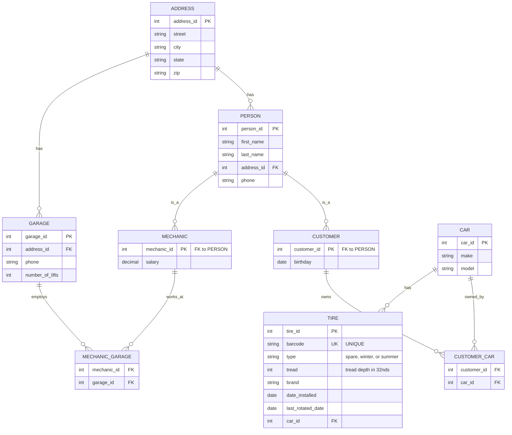

# Discount Tire Database Design - Entity Relationship Diagram

## Overview
This is the database schema for Discount Tire, designed to track customers, mechanics, garages, cars, and tire inventory.

## Mermaid ERD

## Schema Details

### ADDRESS
- **address_id** (PK): Unique identifier for each address
- **street**: Street address
- **city**: City name
- **state**: State abbreviation
- **zip**: ZIP code

### PERSON
- **person_id** (PK): Unique identifier for each person
- **first_name**: Person's first name
- **last_name**: Person's last name
- **address_id** (FK): Reference to ADDRESS table
- **phone**: Contact phone number

### CUSTOMER
- **customer_id** (PK, FK): Foreign key to PERSON.person_id
- **birthday**: Customer's date of birth (for coupon tracking)

### MECHANIC
- **mechanic_id** (PK, FK): Foreign key to PERSON.person_id
- **salary**: Mechanic's salary

### GARAGE
- **garage_id** (PK): Unique identifier for each garage location
- **address_id** (FK): Reference to ADDRESS table for garage location
- **phone**: Garage's phone number
- **number_of_lifts**: Number of vehicle lifts at this location

### CAR
- **car_id** (PK): Unique identifier for each car
- **make**: Car manufacturer
- **model**: Car model

### CUSTOMER_CAR (Junction Table)
- **customer_id** (FK): Reference to CUSTOMER
- **car_id** (FK): Reference to CAR
- **Primary Key**: (customer_id, car_id)
- Note: Cars can have multiple owners, customers can own multiple cars

### TIRE
- **tire_id** (PK): Unique identifier for each tire
- **barcode** (UK): Unique barcode for tire tracking
- **type**: Tire type (spare, winter, or summer)
- **tread**: Tread depth (measured in 32nds of an inch)
- **brand**: Tire manufacturer/brand
- **date_installed**: When the tire was installed on the car
- **last_rotated_date**: When the tire was last rotated
- **car_id** (FK): Reference to CAR (each tire belongs to exactly one car)

### MECHANIC_GARAGE (Junction Table)
- **mechanic_id** (FK): Reference to MECHANIC
- **garage_id** (FK): Reference to GARAGE
- **Primary Key**: (mechanic_id, garage_id)
- Note: Mechanics can work at multiple garages

## Normalization
The schema is normalized to 3NF:
- **1NF**: All attributes contain atomic, single-valued data
- **2NF**: All non-key attributes depend on the entire primary key (junction tables use composite PKs appropriately)
- **3NF**: All non-key attributes depend only on the primary key, not on other non-key attributes

## Answering Key Questions

1. **How many staff members work at more than one garage?**
   - Query MECHANIC_GARAGE, group by mechanic_id, having count > 1

2. **What is the most common type of tire across a customer's cars?**
   - Join CUSTOMER → CUSTOMER_CAR → CAR → TIRE, group by type, order by count DESC

3. **How many mechanics get their tires from Discount Tire?**
   - All mechanics are employed by Discount Tire; count distinct mechanics with cars (via CUSTOMER_CAR if mechanics are also customers)

4. **What's a mechanic's favorite type of tire?**
   - Query mechanic's cars, join to TIRE, group by type, order by count DESC

5. **What is the total number of tires a customer has bought?**
   - Join CUSTOMER → CUSTOMER_CAR → CAR → TIRE, count distinct tires

6. **How many cars has a customer brought in?**
   - Query CUSTOMER_CAR for customer_id, count distinct car_id

7. **Who owns a given car?**
   - Query CUSTOMER_CAR for car_id, join to CUSTOMER and PERSON

8. **How much do we pay mechanics on average?**
   - Query MECHANIC table, avg(salary)

9. **What is the most common birthday month?**
   - Extract month from birthday in CUSTOMER table, group by month, order by count DESC

10. **Which garages are able to handle five customers at the same time?**
    - Query GARAGE where number_of_lifts >= 5

11. **How many cars have bought all of their tires from Discount Tire?**
    - All cars in the system have their tires tracked; count distinct CAR entries

12. **How many tires are installed on a customer's birthday?**
    - Join CUSTOMER → CUSTOMER_CAR → CAR → TIRE where date_installed matches birthday date

13. **What is the average amount of tread left on the tires?**
    - Query TIRE table, avg(tread)

14. **What is the most common brand of tire installed?**
    - Query TIRE, group by brand, order by count DESC

15. **Can the database be expanded?**
    - Yes: Can add service history, service types, parts inventory, supplier tracking, payment history, warranty information, etc.

