# Discount Tire Database Design - Entity Relationship Diagram

## Overview
This is a comprehensive database schema for Discount Tire, designed to manage all aspects of a multi-location tire service business. The system tracks:
- **People & Roles**: Customers, mechanics, and their relationships
- **Locations**: Multiple garage locations with operating hours
- **Vehicles & Tires**: Cars, tire inventory, and installed tires with warranties
- **Services**: Service visits, work performed, and mechanic assignments
- **Financial**: Transactions, payments, and detailed line items
- **Operations**: Work hours, certifications, appointments, and scheduling
- **Business Intelligence**: Customer reviews, supplier management, and purchase orders

This enterprise-grade schema supports complete business operations from appointment scheduling through service completion, payment processing, inventory management, and customer relationship management.

## ERD

```mermaid
erDiagram
    ADDRESS ||--o{ PERSON : "has"
    ADDRESS ||--o{ GARAGE : "has"
    ADDRESS ||--o{ SUPPLIER : "has"
    PERSON ||--o{ CUSTOMER : "is_a"
    PERSON ||--o{ MECHANIC : "is_a"
    CUSTOMER ||--o{ CUSTOMER_CAR : "owns"
    CUSTOMER ||--o{ APPOINTMENT : "schedules"
    CUSTOMER ||--o{ CUSTOMER_REVIEW : "writes"
    CAR ||--o{ CUSTOMER_CAR : "owned_by"
    CAR ||--o{ TIRE : "has"
    CAR ||--o{ SERVICE_VISIT : "visits"
    CAR ||--o{ APPOINTMENT : "for"
    MECHANIC ||--o{ MECHANIC_GARAGE : "works_at"
    MECHANIC ||--o{ WORK_HOURS : "logs"
    MECHANIC ||--o{ SERVICE_PERFORMED : "performs"
    MECHANIC ||--o{ MECHANIC_CERTIFICATION : "has"
    GARAGE ||--o{ MECHANIC_GARAGE : "employs"
    GARAGE ||--o{ WORK_HOURS : "has"
    GARAGE ||--o{ SERVICE_VISIT : "hosts"
    GARAGE ||--o{ TIRE_INVENTORY : "stocks"
    GARAGE ||--o{ GARAGE_HOURS : "operates"
    GARAGE ||--o{ PURCHASE_ORDER : "orders"
    GARAGE ||--o{ APPOINTMENT : "has"
    GARAGE ||--o{ CUSTOMER_REVIEW : "receives"
    SERVICE_VISIT ||--o{ SERVICE_PERFORMED : "includes"
    SERVICE_VISIT ||--o{ TRANSACTION : "generates"
    SERVICE_TYPE ||--o{ SERVICE_PERFORMED : "defines"
    SERVICE_PERFORMED ||--o{ TRANSACTION_LINE_ITEM : "billed_as"
    TIRE ||--o{ WARRANTY : "covered_by"
    TIRE ||--o{ SERVICE_PERFORMED : "serviced"
    TIRE_INVENTORY ||--o{ PURCHASE_ORDER_ITEM : "ordered"
    TIRE_INVENTORY ||--o{ TIRE : "becomes"
    TIRE_INVENTORY ||--o{ TRANSACTION_LINE_ITEM : "sold"
    SUPPLIER ||--o{ PURCHASE_ORDER : "fulfills"
    PURCHASE_ORDER ||--o{ PURCHASE_ORDER_ITEM : "contains"
    TRANSACTION ||--o{ TRANSACTION_LINE_ITEM : "contains"

    ADDRESS {
        int address_id PK
        string street
        string city
        string state
        string zip
    }

    PERSON {
        int person_id PK
        string first_name
        string last_name
        int address_id FK
        string phone
        string email
    }

    CUSTOMER {
        int customer_id PK "FK to PERSON"
        date birthday
        date first_visit_date
        string loyalty_tier
    }

    MECHANIC {
        int mechanic_id PK "FK to PERSON"
        decimal hourly_rate
        date hire_date
    }

    GARAGE {
        int garage_id PK
        int address_id FK
        string phone
        int number_of_lifts
        string manager_name
    }

    CAR {
        int car_id PK
        string make
        string model
        int year
        string vin UK "UNIQUE"
        string license_plate
    }

    CUSTOMER_CAR {
        int customer_id FK
        int car_id FK
    }

    TIRE {
        int tire_id PK
        string barcode UK "UNIQUE"
        string type "spare, winter, or summer"
        int tread "tread depth in 32nds"
        string brand
        string model
        string size
        date date_installed
        date last_rotated_date
        int car_id FK
        int installed_from_inventory_id FK
    }

    MECHANIC_GARAGE {
        int mechanic_id FK
        int garage_id FK
    }

    WORK_HOURS {
        int work_hours_id PK
        int mechanic_id FK
        int garage_id FK
        date work_date
        decimal hours_worked
    }

    SERVICE_VISIT {
        int visit_id PK
        int car_id FK
        int customer_id FK
        int garage_id FK
        datetime check_in_time
        datetime check_out_time
        string status
        int appointment_id FK
    }

    SERVICE_TYPE {
        int service_type_id PK
        string service_name
        string description
        decimal base_price
        int estimated_duration_minutes
    }

    SERVICE_PERFORMED {
        int service_performed_id PK
        int visit_id FK
        int service_type_id FK
        int mechanic_id FK
        int tire_id FK
        datetime start_time
        datetime end_time
        decimal labor_cost
        string notes
    }

    TIRE_INVENTORY {
        int inventory_id PK
        int garage_id FK
        string brand
        string model
        string size
        string type
        int quantity_in_stock
        int reorder_level
        decimal cost_per_tire
        decimal selling_price
        int supplier_id FK
    }

    SUPPLIER {
        int supplier_id PK
        string supplier_name
        string contact_person
        string phone
        string email
        int address_id FK
    }

    PURCHASE_ORDER {
        int po_id PK
        int supplier_id FK
        int garage_id FK
        date order_date
        date delivery_date
        decimal total_cost
        string status
    }

    PURCHASE_ORDER_ITEM {
        int po_item_id PK
        int po_id FK
        int inventory_id FK
        int quantity
        decimal unit_cost
    }

    TRANSACTION {
        int transaction_id PK
        int visit_id FK
        int customer_id FK
        datetime transaction_date
        string payment_method
        decimal subtotal
        decimal tax
        decimal discount
        decimal total
    }

    TRANSACTION_LINE_ITEM {
        int line_item_id PK
        int transaction_id FK
        int service_performed_id FK
        int inventory_id FK
        int tire_id FK
        int quantity
        decimal unit_price
        decimal subtotal
        string description
    }

    WARRANTY {
        int warranty_id PK
        int tire_id FK
        string warranty_type
        date start_date
        date end_date
        int mileage_limit
        string terms
    }

    CUSTOMER_REVIEW {
        int review_id PK
        int customer_id FK
        int visit_id FK
        int garage_id FK
        int rating
        string review_text
        date review_date
    }

    MECHANIC_CERTIFICATION {
        int certification_id PK
        int mechanic_id FK
        string certification_name
        date issue_date
        date expiry_date
        string issuing_body
    }

    GARAGE_HOURS {
        int hours_id PK
        int garage_id FK
        string day_of_week
        time open_time
        time close_time
        boolean is_closed
    }

    APPOINTMENT {
        int appointment_id PK
        int customer_id FK
        int car_id FK
        int garage_id FK
        date appointment_date
        time appointment_time
        int estimated_duration
        string status
        string notes
    }
```

## Schema Details

### ADDRESS
- **address_id** (PK): Unique identifier for each address
- **street**: Street address
- **city**: City name
- **state**: State abbreviation
- **zip**: ZIP code

### PERSON
- **person_id** (PK): Unique identifier for each person
- **first_name**: Person's first name
- **last_name**: Person's last name
- **address_id** (FK): Reference to ADDRESS table
- **phone**: Contact phone number
- **email**: Email address

### CUSTOMER
- **customer_id** (PK, FK): Foreign key to PERSON.person_id
- **birthday**: Customer's date of birth (for coupon tracking)
- **first_visit_date**: When customer first visited
- **loyalty_tier**: Customer loyalty level (bronze, silver, gold, platinum)

### MECHANIC
- **mechanic_id** (PK, FK): Foreign key to PERSON.person_id
- **hourly_rate**: Mechanic's hourly pay rate
- **hire_date**: Date mechanic was hired

### GARAGE
- **garage_id** (PK): Unique identifier for each garage location
- **address_id** (FK): Reference to ADDRESS table for garage location
- **phone**: Garage's phone number
- **number_of_lifts**: Number of vehicle lifts at this location
- **manager_name**: Name of garage manager

### CAR
- **car_id** (PK): Unique identifier for each car
- **make**: Car manufacturer
- **model**: Car model
- **year**: Model year
- **vin** (UK): Vehicle Identification Number (unique)
- **license_plate**: Current license plate number

### CUSTOMER_CAR (Junction Table)
- **customer_id** (FK): Reference to CUSTOMER
- **car_id** (FK): Reference to CAR
- **Primary Key**: (customer_id, car_id)
- Note: Cars can have multiple owners, customers can own multiple cars

### TIRE
- **tire_id** (PK): Unique identifier for each tire
- **barcode** (UK): Unique barcode for tire tracking
- **type**: Tire type (spare, winter, or summer)
- **tread**: Tread depth (measured in 32nds of an inch)
- **brand**: Tire manufacturer/brand
- **model**: Tire model name
- **size**: Tire size (e.g., 225/65R17)
- **date_installed**: When the tire was installed on the car
- **last_rotated_date**: When the tire was last rotated
- **car_id** (FK): Reference to CAR (each tire belongs to exactly one car)
- **installed_from_inventory_id** (FK): Reference to TIRE_INVENTORY item it came from

### MECHANIC_GARAGE (Junction Table)
- **mechanic_id** (FK): Reference to MECHANIC
- **garage_id** (FK): Reference to GARAGE
- **Primary Key**: (mechanic_id, garage_id)
- Note: Mechanics can work at multiple garages

### WORK_HOURS
- **work_hours_id** (PK): Unique identifier for each work hours entry
- **mechanic_id** (FK): Reference to MECHANIC who worked
- **garage_id** (FK): Reference to GARAGE where work was performed
- **work_date**: Date the hours were worked
- **hours_worked**: Number of hours worked (decimal to support partial hours)
- Note: Tracks when and where mechanics work, enabling payroll calculations

### SERVICE_VISIT
- **visit_id** (PK): Unique identifier for each service visit
- **car_id** (FK): Reference to CAR being serviced
- **customer_id** (FK): Reference to CUSTOMER who brought car in
- **garage_id** (FK): Reference to GARAGE where service occurred
- **check_in_time**: When the car arrived for service
- **check_out_time**: When the car was picked up
- **status**: Visit status (scheduled, in_progress, completed, cancelled)
- **appointment_id** (FK): Reference to APPOINTMENT if visit was scheduled
- Note: Central table for tracking all service events

### SERVICE_TYPE
- **service_type_id** (PK): Unique identifier for each service type
- **service_name**: Name of service (installation, rotation, balancing, alignment, inspection, etc.)
- **description**: Detailed description of what the service includes
- **base_price**: Standard price for this service
- **estimated_duration_minutes**: How long the service typically takes
- Note: Master list of all services offered

### SERVICE_PERFORMED
- **service_performed_id** (PK): Unique identifier for each service instance
- **visit_id** (FK): Reference to SERVICE_VISIT when service was done
- **service_type_id** (FK): Reference to SERVICE_TYPE defining the service
- **mechanic_id** (FK): Reference to MECHANIC who performed the service
- **tire_id** (FK): Reference to TIRE if service was tire-specific (optional)
- **start_time**: When mechanic started working
- **end_time**: When mechanic finished working
- **labor_cost**: Actual labor cost charged for this service
- **notes**: Any notes about the service performed
- Note: Links mechanics to specific work done during visits

### TIRE_INVENTORY
- **inventory_id** (PK): Unique identifier for each inventory item
- **garage_id** (FK): Reference to GARAGE stocking the tires
- **brand**: Tire manufacturer
- **model**: Tire model name
- **size**: Tire size specification
- **type**: Tire type (winter, summer, all-season)
- **quantity_in_stock**: Current quantity available
- **reorder_level**: Minimum quantity before reordering
- **cost_per_tire**: What the garage pays per tire
- **selling_price**: What customers pay per tire
- **supplier_id** (FK): Reference to SUPPLIER who provides these tires
- Note: Tracks tire stock levels and pricing at each location

### SUPPLIER
- **supplier_id** (PK): Unique identifier for each supplier
- **supplier_name**: Company name
- **contact_person**: Primary contact at supplier
- **phone**: Contact phone number
- **email**: Contact email address
- **address_id** (FK): Reference to ADDRESS table
- Note: Vendors who supply tires and parts

### PURCHASE_ORDER
- **po_id** (PK): Unique identifier for each purchase order
- **supplier_id** (FK): Reference to SUPPLIER fulfilling order
- **garage_id** (FK): Reference to GARAGE placing order
- **order_date**: When order was placed
- **delivery_date**: When order is expected/arrived
- **total_cost**: Total cost of order
- **status**: Order status (pending, shipped, delivered, cancelled)
- Note: Tracks inventory purchases from suppliers

### PURCHASE_ORDER_ITEM
- **po_item_id** (PK): Unique identifier for each line item
- **po_id** (FK): Reference to PURCHASE_ORDER
- **inventory_id** (FK): Reference to TIRE_INVENTORY item being ordered
- **quantity**: Number of tires ordered
- **unit_cost**: Cost per tire on this order
- Note: Individual items within a purchase order

### TRANSACTION
- **transaction_id** (PK): Unique identifier for each transaction
- **visit_id** (FK): Reference to SERVICE_VISIT being paid for
- **customer_id** (FK): Reference to CUSTOMER making payment
- **transaction_date**: When payment was made
- **payment_method**: How customer paid (cash, credit, debit, check, financing)
- **subtotal**: Total before tax
- **tax**: Tax amount
- **discount**: Any discounts applied
- **total**: Final amount paid
- Note: Financial record of customer payments

### TRANSACTION_LINE_ITEM
- **line_item_id** (PK): Unique identifier for each line item
- **transaction_id** (FK): Reference to TRANSACTION
- **service_performed_id** (FK): Reference to SERVICE_PERFORMED (if billing for service)
- **inventory_id** (FK): Reference to TIRE_INVENTORY (if billing for tire purchase)
- **tire_id** (FK): Reference to specific TIRE installed
- **quantity**: Number of items/services
- **unit_price**: Price per item/service
- **subtotal**: Line item total
- **description**: Description of what was purchased
- Note: Itemized breakdown of what customer paid for

### WARRANTY
- **warranty_id** (PK): Unique identifier for each warranty
- **tire_id** (FK): Reference to TIRE covered by warranty
- **warranty_type**: Type of warranty (manufacturer, store, road hazard)
- **start_date**: When warranty coverage begins
- **end_date**: When warranty expires
- **mileage_limit**: Maximum miles covered
- **terms**: Warranty terms and conditions
- Note: Tracks warranty coverage for installed tires

### CUSTOMER_REVIEW
- **review_id** (PK): Unique identifier for each review
- **customer_id** (FK): Reference to CUSTOMER who wrote review
- **visit_id** (FK): Reference to SERVICE_VISIT being reviewed
- **garage_id** (FK): Reference to GARAGE being reviewed
- **rating**: Rating from 1-5
- **review_text**: Written review comments
- **review_date**: When review was submitted
- Note: Customer feedback and satisfaction tracking

### MECHANIC_CERTIFICATION
- **certification_id** (PK): Unique identifier for each certification
- **mechanic_id** (FK): Reference to MECHANIC who holds certification
- **certification_name**: Name of certification (ASE, manufacturer-specific, etc.)
- **issue_date**: When certification was obtained
- **expiry_date**: When certification expires
- **issuing_body**: Organization that issued certification
- Note: Tracks mechanic qualifications and skills

### GARAGE_HOURS
- **hours_id** (PK): Unique identifier for each schedule entry
- **garage_id** (FK): Reference to GARAGE
- **day_of_week**: Day (Monday, Tuesday, etc.)
- **open_time**: Opening time
- **close_time**: Closing time
- **is_closed**: Whether garage is closed this day
- Note: Operating hours for each garage location

### APPOINTMENT
- **appointment_id** (PK): Unique identifier for each appointment
- **customer_id** (FK): Reference to CUSTOMER who scheduled
- **car_id** (FK): Reference to CAR coming in for service
- **garage_id** (FK): Reference to GARAGE where appointment is scheduled
- **appointment_date**: Date of appointment
- **appointment_time**: Time of appointment
- **estimated_duration**: Expected duration in minutes
- **status**: Appointment status (scheduled, confirmed, in_progress, completed, no_show, cancelled)
- **notes**: Special requests or notes
- Note: Scheduling system for customer visits

## Normalization
The schema is normalized to 3NF:
- **1NF**: All attributes contain atomic, single-valued data
- **2NF**: All non-key attributes depend on the entire primary key (junction tables use composite PKs appropriately)
- **3NF**: All non-key attributes depend only on the primary key, not on other non-key attributes

## Answering Key Questions

### Original Questions

1. **How many staff members work at more than one garage?**
   - Query MECHANIC_GARAGE, group by mechanic_id, having count > 1

2. **What is the most common type of tire across a customer's cars?**
   - Join CUSTOMER → CUSTOMER_CAR → CAR → TIRE, group by type, order by count DESC

3. **How many mechanics get their tires from Discount Tire?**
   - Join MECHANIC to CUSTOMER (via PERSON), then to CUSTOMER_CAR → CAR → TIRE, count distinct mechanics

4. **What's a mechanic's favorite type of tire?**
   - Join MECHANIC to CUSTOMER (via PERSON) → CUSTOMER_CAR → CAR → TIRE, group by type, order by count DESC

5. **What is the total number of tires a customer has bought?**
   - Join TRANSACTION_LINE_ITEM where customer_id matches, count tires (via tire_id or inventory_id)

6. **How many cars has a customer brought in?**
   - Query SERVICE_VISIT for customer_id, count distinct car_id

7. **Who owns a given car?**
   - Query CUSTOMER_CAR for car_id, join to CUSTOMER and PERSON

8. **How much do we pay mechanics on average?**
   - Join MECHANIC with WORK_HOURS, calculate sum(hours_worked * hourly_rate) for each mechanic, then average
   - For average hourly rate: avg(hourly_rate) from MECHANIC

9. **What is the most common birthday month?**
   - Extract month from birthday in CUSTOMER, group by month, order by count DESC

10. **Which garages are able to handle five customers at the same time?**
    - Query GARAGE where number_of_lifts >= 5

11. **How many cars have bought all of their tires from Discount Tire?**
    - Count cars where all tires have installed_from_inventory_id not null

12. **How many tires are installed on a customer's birthday?**
    - Join CUSTOMER → CUSTOMER_CAR → CAR → TIRE where date_installed matches birthday (month and day)

13. **What is the average amount of tread left on the tires?**
    - Query TIRE table, avg(tread)

14. **What is the most common brand of tire installed?**
    - Query TIRE, group by brand, order by count DESC

15. **Can the database be expanded?**
    - The database has been significantly expanded! Current capabilities include full service tracking, inventory management, financial transactions, appointments, warranties, and customer reviews.

### Service & Work Tracking Questions

16. **Which mechanic installed a specific tire?**
    - Join TIRE → SERVICE_PERFORMED → MECHANIC where service_type is "installation"

17. **What services were performed during a visit?**
    - Query SERVICE_PERFORMED for visit_id, join to SERVICE_TYPE

18. **Which garage installed a specific tire?**
    - Join TIRE → SERVICE_PERFORMED → SERVICE_VISIT → GARAGE

19. **How long did a service take?**
    - Query SERVICE_PERFORMED, calculate end_time - start_time

20. **Which mechanic worked on which car?**
    - Join MECHANIC → SERVICE_PERFORMED → SERVICE_VISIT → CAR

21. **What's the average time for tire installation?**
    - Query SERVICE_PERFORMED where service_type is installation, avg(end_time - start_time)

22. **How many services has a mechanic completed today?**
    - Query SERVICE_PERFORMED for mechanic_id where date matches today

23. **Which mechanic is most productive?**
    - Count SERVICE_PERFORMED by mechanic_id, order by count DESC

### Financial & Business Questions

24. **How much did a customer pay for their visit?**
    - Query TRANSACTION for visit_id

25. **What's the revenue per garage this month?**
    - Join TRANSACTION → SERVICE_VISIT → GARAGE, sum(total) where month matches

26. **What's the profit margin on a specific tire?**
    - Query TIRE_INVENTORY, calculate (selling_price - cost_per_tire) / selling_price

27. **What payment methods are most common?**
    - Query TRANSACTION, group by payment_method, count

28. **What's total revenue for the year?**
    - Query TRANSACTION, sum(total) where year matches

29. **Which tire brand generates most revenue?**
    - Join TRANSACTION_LINE_ITEM → TIRE_INVENTORY, group by brand, sum(subtotal)

30. **What's the average transaction value?**
    - Query TRANSACTION, avg(total)

31. **How much profit did we make on tire sales this month?**
    - Join TRANSACTION_LINE_ITEM → TIRE_INVENTORY, sum(unit_price - cost_per_tire) * quantity

### Customer Experience Questions

32. **When did a customer last visit?**
    - Query SERVICE_VISIT for customer_id, order by check_in_time DESC, limit 1

33. **What's a customer's service history?**
    - Join CUSTOMER → SERVICE_VISIT → SERVICE_PERFORMED → SERVICE_TYPE

34. **How often does a customer visit?**
    - Query SERVICE_VISIT for customer_id, count visits, calculate frequency

35. **What's the average customer rating for a garage?**
    - Query CUSTOMER_REVIEW for garage_id, avg(rating)

36. **Which garage has the highest customer satisfaction?**
    - Query CUSTOMER_REVIEW, group by garage_id, avg(rating), order DESC

37. **What warranty covers a specific tire?**
    - Query WARRANTY for tire_id

38. **How many customers have upcoming appointments?**
    - Query APPOINTMENT where status = 'scheduled' and appointment_date >= today

39. **Which customers haven't visited in over a year?**
    - Query SERVICE_VISIT, group by customer_id, having max(check_in_time) < one year ago

### Inventory & Supply Chain Questions

40. **How many tires are in stock at each garage?**
    - Query TIRE_INVENTORY, group by garage_id, sum(quantity_in_stock)

41. **Which tires need reordering?**
    - Query TIRE_INVENTORY where quantity_in_stock <= reorder_level

42. **Who supplies a specific tire brand?**
    - Join TIRE_INVENTORY → SUPPLIER where brand matches

43. **What's the total value of inventory at a garage?**
    - Query TIRE_INVENTORY for garage_id, sum(quantity_in_stock * cost_per_tire)

44. **Which supplier do we order from most?**
    - Query PURCHASE_ORDER, group by supplier_id, count

45. **What's our average order size?**
    - Join PURCHASE_ORDER → PURCHASE_ORDER_ITEM, avg(quantity)

46. **Which tire sizes are most popular?**
    - Query TIRE, group by size, count, order DESC

### Operational Questions

47. **Which mechanics are certified for specific services?**
    - Query MECHANIC_CERTIFICATION for certification_name

48. **When is a garage open on Tuesdays?**
    - Query GARAGE_HOURS where day_of_week = 'Tuesday'

49. **Which garage is busiest (most visits)?**
    - Query SERVICE_VISIT, group by garage_id, count, order DESC

50. **What's the average wait time for service?**
    - Query APPOINTMENT → SERVICE_VISIT, calculate check_in_time - appointment_time, average

51. **How many appointments are scheduled for tomorrow?**
    - Query APPOINTMENT where appointment_date = tomorrow and status = 'scheduled'

52. **Which mechanics have expiring certifications?**
    - Query MECHANIC_CERTIFICATION where expiry_date < 90 days from now

53. **What's the average number of lifts being used?**
    - Query SERVICE_VISIT where status = 'in_progress', group by garage_id, count

### Advanced Analytics Questions

54. **Customer lifetime value?**
    - Join CUSTOMER → TRANSACTION, sum(total) per customer

55. **Which customers are most loyal?**
    - Query CUSTOMER, order by first_visit_date ASC, join to count of visits

56. **Seasonal tire demand patterns?**
    - Query TIRE, extract month from date_installed, group by type and month

57. **Mechanic efficiency (revenue per hour)?**
    - Join SERVICE_PERFORMED → TRANSACTION_LINE_ITEM, sum revenue per mechanic, divide by WORK_HOURS

58. **Inventory turnover rate?**
    - Compare PURCHASE_ORDER quantities to sales from TRANSACTION_LINE_ITEM over time

59. **Customer acquisition trends?**
    - Query CUSTOMER, group by month of first_visit_date, count

60. **Service type profitability?**
    - Join SERVICE_PERFORMED → TRANSACTION_LINE_ITEM, calculate labor_cost vs unit_price, group by service_type

## Database Summary

### Tables Overview
- **Total Tables**: 23
- **Core Entity Tables**: 8 (ADDRESS, PERSON, CUSTOMER, MECHANIC, GARAGE, CAR, TIRE, SUPPLIER)
- **Junction Tables**: 2 (CUSTOMER_CAR, MECHANIC_GARAGE)
- **Operational Tables**: 13 (SERVICE_VISIT, SERVICE_TYPE, SERVICE_PERFORMED, WORK_HOURS, TIRE_INVENTORY, PURCHASE_ORDER, PURCHASE_ORDER_ITEM, TRANSACTION, TRANSACTION_LINE_ITEM, WARRANTY, CUSTOMER_REVIEW, MECHANIC_CERTIFICATION, GARAGE_HOURS, APPOINTMENT)

### Key Features
1. **Multi-location Support**: Garages can have their own inventory, staff, and operating hours
2. **Complete Service Tracking**: Links mechanics to specific work performed on specific vehicles
3. **Inventory Management**: Real-time stock levels, reorder points, and supplier tracking
4. **Financial Reporting**: Detailed transaction records with line-item breakdowns
5. **Customer Relationship Management**: Service history, reviews, appointments, and loyalty tracking
6. **Workforce Management**: Hour tracking, certifications, and multi-location assignments
7. **Warranty Tracking**: Complete warranty information for every tire
8. **Appointment System**: Scheduling with status tracking and duration estimates

### Business Capabilities
- Point of Sale (POS) system with detailed invoicing
- Inventory management with automatic reorder alerts
- Customer loyalty and retention tracking
- Service history and maintenance reminders
- Multi-garage operations with centralized reporting
- Payroll calculation based on hours worked
- Profit margin analysis by product and service
- Customer satisfaction monitoring
- Supplier relationship management
- Mechanic productivity and efficiency tracking

### Potential Enhancements
While comprehensive, the database could be further expanded with:
- **Marketing**: Email campaigns, promotions, coupon tracking
- **Parts Inventory**: Non-tire parts and supplies management
- **Employee Benefits**: Insurance, vacation tracking, benefits administration
- **Fleet Management**: Corporate/fleet customer special handling
- **Online Booking**: Integration with web/mobile appointment booking
- **Loyalty Programs**: Points system, rewards tracking
- **SMS/Email Notifications**: Appointment reminders, service completion alerts
- **Vehicle Maintenance History**: Beyond tires (oil changes, inspections, etc.)
- **Manufacturer Rebates**: Tracking and claiming tire manufacturer promotions
- **Environmental Tracking**: Tire recycling and disposal records

