# Online Fly Shop Database Design - Entity Relationship Diagram

## Overview
This is a comprehensive database schema for an online fly fishing shop (e-commerce platform), designed to manage all aspects of a specialized outdoor retail business. The system tracks:
- **Products**: Flies, rods, reels, lines, tackle, apparel, and accessories with detailed specifications
- **Fly-Specific Data**: Fly patterns, tiers, target species, and water conditions
- **Customers**: User accounts, addresses, and preferences
- **E-commerce**: Shopping carts, orders, payments, and shipping
- **Inventory**: Stock levels, suppliers, and reordering
- **Engagement**: Product reviews, wishlists, and ratings

This specialized schema captures the unique requirements of fly fishing retail, including technical specifications for equipment, fly pattern details, species targeting, and water condition matching.

## Mermaid ERD

```mermaid
erDiagram
    CUSTOMER ||--o{ ADDRESS : "has"
    CUSTOMER ||--o{ SHOPPING_CART : "has"
    CUSTOMER ||--o{ ORDER : "places"
    CUSTOMER ||--o{ PRODUCT_REVIEW : "writes"
    CUSTOMER ||--o{ WISHLIST : "maintains"
    ADDRESS ||--o{ ORDER : "ships_to"
    PRODUCT_CATEGORY ||--o{ PRODUCT_CATEGORY : "parent_of"
    PRODUCT_CATEGORY ||--o{ PRODUCT : "contains"
    PRODUCT ||--o{ PRODUCT_IMAGE : "has"
    PRODUCT ||--o{ PRODUCT_VARIANT : "has"
    PRODUCT ||--o{ INVENTORY : "tracked_in"
    PRODUCT ||--o{ CART_ITEM : "in_cart"
    PRODUCT ||--o{ ORDER_ITEM : "ordered"
    PRODUCT ||--o{ PRODUCT_REVIEW : "reviewed"
    PRODUCT ||--o{ WISHLIST : "desired"
    PRODUCT ||--o{ FLY_PATTERN : "is_a"
    PRODUCT_VARIANT ||--o{ CART_ITEM : "selected"
    PRODUCT_VARIANT ||--o{ ORDER_ITEM : "ordered"
    PRODUCT_VARIANT ||--o{ INVENTORY : "stocked"
    SUPPLIER ||--o{ PRODUCT : "supplies"
    SUPPLIER ||--o{ INVENTORY : "restocks"
    SHOPPING_CART ||--o{ CART_ITEM : "contains"
    ORDER ||--o{ ORDER_ITEM : "contains"
    ORDER ||--o{ SHIPPING : "has"
    ORDER ||--o{ PAYMENT : "paid_by"
    FLY_PATTERN ||--o{ FLY_PATTERN_SPECIES : "targets"
    FLY_PATTERN ||--o{ FLY_PATTERN_CONDITION : "works_in"
    FLY_TIER ||--o{ FLY_PATTERN : "ties"
    TARGET_SPECIES ||--o{ FLY_PATTERN_SPECIES : "targeted_by"
    WATER_CONDITION ||--o{ FLY_PATTERN_CONDITION : "suited_for"

    CUSTOMER {
        int customer_id PK
        string email UK "UNIQUE"
        string password_hash
        string first_name
        string last_name
        string phone
        date date_joined
        date last_login
        boolean is_active
        string account_status
    }

    ADDRESS {
        int address_id PK
        int customer_id FK
        string address_type "billing, shipping"
        string street_line1
        string street_line2
        string city
        string state
        string postal_code
        string country
        boolean is_default
    }

    PRODUCT_CATEGORY {
        int category_id PK
        int parent_category_id FK
        string category_name
        string description
        string slug
        int display_order
    }

    PRODUCT {
        int product_id PK
        int category_id FK
        int supplier_id FK
        string sku UK "UNIQUE"
        string product_name
        text description
        decimal base_price
        decimal sale_price
        decimal weight
        string weight_unit
        boolean is_active
        boolean is_featured
        date created_at
        date updated_at
        int view_count
        string meta_title
        text meta_description
    }

    PRODUCT_IMAGE {
        int image_id PK
        int product_id FK
        string image_url
        string alt_text
        int display_order
        boolean is_primary
    }

    PRODUCT_VARIANT {
        int variant_id PK
        int product_id FK
        string variant_name
        string size
        string color
        string weight_rating
        decimal price_adjustment
        string sku UK "UNIQUE"
    }

    INVENTORY {
        int inventory_id PK
        int product_id FK
        int variant_id FK
        int supplier_id FK
        int quantity_in_stock
        int reorder_level
        int reorder_quantity
        decimal cost_per_unit
        date last_restocked
        string warehouse_location
    }

    SUPPLIER {
        int supplier_id PK
        string supplier_name
        string contact_person
        string email
        string phone
        string website
        text notes
        boolean is_active
    }

    SHOPPING_CART {
        int cart_id PK
        int customer_id FK
        datetime created_at
        datetime updated_at
    }

    CART_ITEM {
        int cart_item_id PK
        int cart_id FK
        int product_id FK
        int variant_id FK
        int quantity
        datetime added_at
    }

    ORDER {
        int order_id PK
        int customer_id FK
        int shipping_address_id FK
        string order_number UK "UNIQUE"
        datetime order_date
        string order_status
        decimal subtotal
        decimal tax
        decimal shipping_cost
        decimal discount
        decimal total
        text notes
    }

    ORDER_ITEM {
        int order_item_id PK
        int order_id FK
        int product_id FK
        int variant_id FK
        int quantity
        decimal unit_price
        decimal subtotal
    }

    SHIPPING {
        int shipping_id PK
        int order_id FK
        string carrier
        string tracking_number
        string shipping_method
        datetime shipped_date
        datetime estimated_delivery
        datetime delivered_date
        string status
    }

    PAYMENT {
        int payment_id PK
        int order_id FK
        string payment_method
        string transaction_id
        decimal amount
        string currency
        datetime payment_date
        string status
    }

    PRODUCT_REVIEW {
        int review_id PK
        int product_id FK
        int customer_id FK
        int rating
        string review_title
        text review_text
        datetime review_date
        boolean is_verified_purchase
        int helpful_count
    }

    WISHLIST {
        int wishlist_id PK
        int customer_id FK
        int product_id FK
        datetime added_at
        text notes
    }

    FLY_PATTERN {
        int pattern_id PK
        int product_id FK "ONE-TO-ONE"
        int tier_id FK
        string pattern_name
        string hook_size
        string fly_type "dry, wet, nymph, streamer, emerger"
        text materials
        text tying_instructions
        string difficulty_level
        boolean is_hand_tied
    }

    FLY_TIER {
        int tier_id PK
        string tier_name
        text bio
        string website
        string location
        int years_experience
    }

    TARGET_SPECIES {
        int species_id PK
        string species_name
        string species_type "trout, bass, salmon, etc"
        text description
    }

    WATER_CONDITION {
        int condition_id PK
        string condition_name
        string water_type "river, lake, stream, saltwater"
        string flow_type "fast, slow, still"
        string clarity "clear, murky, stained"
        string season
    }

    FLY_PATTERN_SPECIES {
        int fly_species_id PK
        int pattern_id FK
        int species_id FK
        int effectiveness_rating
    }

    FLY_PATTERN_CONDITION {
        int fly_condition_id PK
        int pattern_id FK
        int condition_id FK
        int effectiveness_rating
    }
```

## Schema Details

### CUSTOMER
- **customer_id** (PK): Unique identifier for each customer
- **email** (UK): Customer's email address (unique, used for login)
- **password_hash**: Securely hashed password
- **first_name**: Customer's first name
- **last_name**: Customer's last name
- **phone**: Contact phone number
- **date_joined**: When account was created
- **last_login**: Last login timestamp
- **is_active**: Whether account is active
- **account_status**: Account status (active, suspended, deleted)

### ADDRESS
- **address_id** (PK): Unique identifier for each address
- **customer_id** (FK): Reference to CUSTOMER
- **address_type**: Type of address (billing, shipping)
- **street_line1**: Street address line 1
- **street_line2**: Street address line 2 (optional)
- **city**: City name
- **state**: State/province
- **postal_code**: ZIP/postal code
- **country**: Country name
- **is_default**: Whether this is the default address for this type

### PRODUCT_CATEGORY
- **category_id** (PK): Unique identifier for each category
- **parent_category_id** (FK): Self-reference for hierarchical categories
- **category_name**: Name of category (Flies, Rods, Reels, Line, Tackle, Apparel, etc.)
- **description**: Category description
- **slug**: URL-friendly category identifier
- **display_order**: Order for displaying categories

### PRODUCT
- **product_id** (PK): Unique identifier for each product
- **category_id** (FK): Reference to PRODUCT_CATEGORY
- **supplier_id** (FK): Reference to SUPPLIER
- **sku** (UK): Stock Keeping Unit (unique identifier)
- **product_name**: Product name
- **description**: Detailed product description
- **base_price**: Standard price
- **sale_price**: Sale price (if on sale)
- **weight**: Product weight for shipping
- **weight_unit**: Unit of measurement (oz, lb, g, kg)
- **is_active**: Whether product is available for purchase
- **is_featured**: Whether product is featured on homepage
- **created_at**: When product was added
- **updated_at**: Last update timestamp
- **view_count**: Number of times product page viewed
- **meta_title**: SEO title
- **meta_description**: SEO description

### PRODUCT_IMAGE
- **image_id** (PK): Unique identifier for each image
- **product_id** (FK): Reference to PRODUCT
- **image_url**: URL/path to image file
- **alt_text**: Alternative text for accessibility
- **display_order**: Order for displaying images
- **is_primary**: Whether this is the main product image

### PRODUCT_VARIANT
- **variant_id** (PK): Unique identifier for each variant
- **product_id** (FK): Reference to PRODUCT
- **variant_name**: Name of variant
- **size**: Size specification (for flies: hook size #10-#20, for apparel: S/M/L/XL)
- **color**: Color option
- **weight_rating**: Weight rating (for rods/reels: 3wt, 5wt, 8wt, etc.)
- **price_adjustment**: Price difference from base price
- **sku** (UK): Unique SKU for this variant

### INVENTORY
- **inventory_id** (PK): Unique identifier for inventory record
- **product_id** (FK): Reference to PRODUCT
- **variant_id** (FK): Reference to PRODUCT_VARIANT (optional)
- **supplier_id** (FK): Reference to SUPPLIER
- **quantity_in_stock**: Current stock quantity
- **reorder_level**: Minimum quantity before reordering
- **reorder_quantity**: How many to order when restocking
- **cost_per_unit**: What the shop pays per unit
- **last_restocked**: Last restock date
- **warehouse_location**: Physical location in warehouse

### SUPPLIER
- **supplier_id** (PK): Unique identifier for each supplier
- **supplier_name**: Company name
- **contact_person**: Primary contact
- **email**: Contact email
- **phone**: Contact phone
- **website**: Supplier website
- **notes**: Additional notes about supplier
- **is_active**: Whether currently working with this supplier

### SHOPPING_CART
- **cart_id** (PK): Unique identifier for each cart
- **customer_id** (FK): Reference to CUSTOMER
- **created_at**: When cart was created
- **updated_at**: Last modification timestamp

### CART_ITEM
- **cart_item_id** (PK): Unique identifier for each cart item
- **cart_id** (FK): Reference to SHOPPING_CART
- **product_id** (FK): Reference to PRODUCT
- **variant_id** (FK): Reference to PRODUCT_VARIANT (optional)
- **quantity**: Number of items
- **added_at**: When item was added to cart

### ORDER
- **order_id** (PK): Unique identifier for each order
- **customer_id** (FK): Reference to CUSTOMER
- **shipping_address_id** (FK): Reference to ADDRESS
- **order_number** (UK): Human-readable unique order number
- **order_date**: When order was placed
- **order_status**: Order status (pending, processing, shipped, delivered, cancelled, refunded)
- **subtotal**: Total before tax and shipping
- **tax**: Tax amount
- **shipping_cost**: Shipping cost
- **discount**: Discount applied
- **total**: Final total
- **notes**: Customer notes or special instructions

### ORDER_ITEM
- **order_item_id** (PK): Unique identifier for each order item
- **order_id** (FK): Reference to ORDER
- **product_id** (FK): Reference to PRODUCT
- **variant_id** (FK): Reference to PRODUCT_VARIANT (optional)
- **quantity**: Number of items ordered
- **unit_price**: Price per item at time of order
- **subtotal**: Line item total

### SHIPPING
- **shipping_id** (PK): Unique identifier for shipping record
- **order_id** (FK): Reference to ORDER
- **carrier**: Shipping carrier (USPS, UPS, FedEx, etc.)
- **tracking_number**: Package tracking number
- **shipping_method**: Method (Ground, Express, Overnight, etc.)
- **shipped_date**: When package was shipped
- **estimated_delivery**: Expected delivery date
- **delivered_date**: Actual delivery date
- **status**: Shipping status (pending, in_transit, delivered, failed)

### PAYMENT
- **payment_id** (PK): Unique identifier for payment record
- **order_id** (FK): Reference to ORDER
- **payment_method**: Method (credit_card, paypal, stripe, etc.)
- **transaction_id**: Payment processor transaction ID
- **amount**: Payment amount
- **currency**: Currency code (USD, EUR, etc.)
- **payment_date**: When payment was processed
- **status**: Payment status (pending, completed, failed, refunded)

### PRODUCT_REVIEW
- **review_id** (PK): Unique identifier for each review
- **product_id** (FK): Reference to PRODUCT
- **customer_id** (FK): Reference to CUSTOMER
- **rating**: Rating from 1-5 stars
- **review_title**: Short review headline
- **review_text**: Detailed review
- **review_date**: When review was submitted
- **is_verified_purchase**: Whether reviewer actually purchased item
- **helpful_count**: Number of "helpful" votes

### WISHLIST
- **wishlist_id** (PK): Unique identifier for wishlist item
- **customer_id** (FK): Reference to CUSTOMER
- **product_id** (FK): Reference to PRODUCT
- **added_at**: When item was added to wishlist
- **notes**: Customer notes about why they want this item

### FLY_PATTERN
- **pattern_id** (PK): Unique identifier for fly pattern
- **product_id** (FK): One-to-one reference to PRODUCT (only for fly products)
- **tier_id** (FK): Reference to FLY_TIER who created/ties this pattern
- **pattern_name**: Traditional pattern name (Adams, Elk Hair Caddis, Woolly Bugger, etc.)
- **hook_size**: Hook size range (e.g., "#12-16")
- **fly_type**: Type of fly (dry, wet, nymph, streamer, emerger, terrestrial)
- **materials**: List of materials used in tying
- **tying_instructions**: How to tie the fly
- **difficulty_level**: Tying difficulty (beginner, intermediate, advanced)
- **is_hand_tied**: Whether fly is hand-tied vs mass-produced

### FLY_TIER
- **tier_id** (PK): Unique identifier for fly tier
- **tier_name**: Tier's name or company name
- **bio**: Biography and background
- **website**: Personal or company website
- **location**: Where tier is based
- **years_experience**: Years tying flies

### TARGET_SPECIES
- **species_id** (PK): Unique identifier for each species
- **species_name**: Name of fish species
- **species_type**: Category (trout, bass, salmon, steelhead, panfish, saltwater, etc.)
- **description**: Information about the species

### WATER_CONDITION
- **condition_id** (PK): Unique identifier for water condition
- **condition_name**: Name/description of condition
- **water_type**: Type of water (river, stream, lake, pond, saltwater, tailwater)
- **flow_type**: Water flow (fast, moderate, slow, still)
- **clarity**: Water clarity (clear, stained, murky)
- **season**: Best season (spring, summer, fall, winter)

### FLY_PATTERN_SPECIES (Junction Table)
- **fly_species_id** (PK): Unique identifier
- **pattern_id** (FK): Reference to FLY_PATTERN
- **species_id** (FK): Reference to TARGET_SPECIES
- **effectiveness_rating**: How effective (1-5 rating)
- Note: Links flies to the fish species they target

### FLY_PATTERN_CONDITION (Junction Table)
- **fly_condition_id** (PK): Unique identifier
- **pattern_id** (FK): Reference to FLY_PATTERN
- **condition_id** (FK): Reference to WATER_CONDITION
- **effectiveness_rating**: How effective in these conditions (1-5 rating)
- Note: Links flies to the water conditions where they work best

## Normalization
The schema is normalized to 3NF:
- **1NF**: All attributes contain atomic, single-valued data
- **2NF**: All non-key attributes depend on the entire primary key (junction tables use composite PKs where appropriate)
- **3NF**: All non-key attributes depend only on the primary key, not on other non-key attributes

## Interesting Questions This Database Can Answer

### Customer & Sales Analytics

1. **Who are our top customers by revenue?**
   - Query ORDER, group by customer_id, sum(total), order DESC

2. **What's the average order value?**
   - Query ORDER, avg(total)

3. **How many abandoned carts do we have?**
   - Query SHOPPING_CART with CART_ITEM where no corresponding ORDER exists

4. **What's the customer lifetime value?**
   - Join CUSTOMER → ORDER, sum(total) per customer

5. **What's our customer retention rate?**
   - Compare customers with multiple orders vs single orders

6. **Which customers have items in their wishlist but haven't purchased?**
   - Join WISHLIST → CUSTOMER, exclude customers with recent orders for those products

7. **What's the average time from registration to first purchase?**
   - Compare CUSTOMER.date_joined to first ORDER.order_date

### Product Performance

8. **What are our best-selling products?**
   - Join ORDER_ITEM, group by product_id, sum(quantity), order DESC

9. **Which products have the highest profit margins?**
   - Join PRODUCT → INVENTORY, calculate (base_price - cost_per_unit) / base_price

10. **What products are viewed most but purchased least?**
    - Compare PRODUCT.view_count to ORDER_ITEM quantities

11. **Which products get the best reviews?**
    - Query PRODUCT_REVIEW, group by product_id, avg(rating), order DESC

12. **What's the average rating for each product category?**
    - Join PRODUCT → PRODUCT_CATEGORY → PRODUCT_REVIEW, avg(rating)

13. **Which products need restocking?**
    - Query INVENTORY where quantity_in_stock <= reorder_level

14. **What's the inventory turnover rate?**
    - Compare sales from ORDER_ITEM to INVENTORY quantities over time

### Fly Fishing Specific Questions

15. **What's the most popular fly pattern?**
    - Join FLY_PATTERN → PRODUCT → ORDER_ITEM, count sales

16. **Which flies work best for trout in rivers?**
    - Join FLY_PATTERN → FLY_PATTERN_SPECIES → TARGET_SPECIES (where species_type='trout')
    - Join to FLY_PATTERN_CONDITION → WATER_CONDITION (where water_type='river')
    - Order by effectiveness_rating

17. **What flies are best for spring fishing in fast-moving streams?**
    - Query FLY_PATTERN_CONDITION → WATER_CONDITION where season='spring' and flow_type='fast'

18. **Which fly tier's patterns sell best?**
    - Join FLY_TIER → FLY_PATTERN → PRODUCT → ORDER_ITEM, count sales

19. **What's the most versatile fly (works for most species)?**
    - Query FLY_PATTERN_SPECIES, group by pattern_id, count distinct species_id

20. **Which flies are effective in multiple water conditions?**
    - Query FLY_PATTERN_CONDITION, group by pattern_id, count distinct condition_id

21. **What hook sizes are most popular?**
    - Query FLY_PATTERN → PRODUCT → ORDER_ITEM, group by hook_size

22. **Which fly types (dry, wet, nymph, streamer) sell best in each season?**
    - Join sales data with water conditions by season

### Inventory & Supply Chain

23. **Which suppliers provide the most products?**
    - Query PRODUCT, group by supplier_id, count

24. **What's our inventory value by category?**
    - Join INVENTORY → PRODUCT → PRODUCT_CATEGORY, sum(quantity_in_stock * cost_per_unit)

25. **Which products have the longest time since last restock?**
    - Query INVENTORY, order by last_restocked ASC

26. **What's the average reorder frequency per supplier?**
    - Track INVENTORY.last_restocked by supplier over time

### Shipping & Fulfillment

27. **What's the average shipping time by carrier?**
    - Query SHIPPING, calculate delivered_date - shipped_date, group by carrier, avg

28. **Which shipping method is most popular?**
    - Query SHIPPING, group by shipping_method, count

29. **How many orders are currently in transit?**
    - Query SHIPPING where status='in_transit'

30. **What's the on-time delivery rate?**
    - Compare SHIPPING.delivered_date to estimated_delivery

### Marketing & Engagement

31. **Which products should we promote (high wishlist count)?**
    - Query WISHLIST, group by product_id, count, order DESC

32. **What products are frequently reviewed?**
    - Query PRODUCT_REVIEW, group by product_id, count

33. **Which customers are most engaged (reviews + purchases)?**
    - Join CUSTOMER to ORDER and PRODUCT_REVIEW, calculate engagement score

34. **What products are most viewed but least purchased (conversion rate)?**
    - Compare PRODUCT.view_count to ORDER_ITEM quantities

35. **Which product combinations are frequently purchased together?**
    - Self-join ORDER_ITEM on order_id, find common product pairs

### Seasonal & Trend Analysis

36. **What are our best-selling products by season?**
    - Query ORDER with ORDER_ITEM, extract season from order_date, group by product and season

37. **How do dry fly sales compare to nymph sales by month?**
    - Join FLY_PATTERN → PRODUCT → ORDER_ITEM, group by fly_type and month

38. **What's the peak shopping time of day?**
    - Extract hour from ORDER.order_date, group by hour, count

39. **What categories grow fastest year-over-year?**
    - Compare sales by PRODUCT_CATEGORY across years

40. **Which flies become more popular in specific seasons?**
    - Cross-reference sales patterns with WATER_CONDITION seasons

### Customer Preferences & Recommendations

41. **What products do customers who bought X also buy?**
    - Self-join ORDER_ITEM through ORDER table, find correlation

42. **What's the average cart size?**
    - Query CART_ITEM, group by cart_id, avg(count)

43. **Which customers prefer hand-tied vs mass-produced flies?**
    - Join ORDER_ITEM → PRODUCT → FLY_PATTERN, analyze is_hand_tied preference

44. **What rod weights are most popular?**
    - Query PRODUCT_VARIANT where weight_rating is not null, count sales

45. **Do customers who buy premium rods also buy premium flies?**
    - Analyze purchasing patterns across price points

### Business Intelligence

46. **What's our revenue by product category?**
    - Join ORDER_ITEM → PRODUCT → PRODUCT_CATEGORY, sum(subtotal)

47. **What's the return on investment for featured products?**
    - Compare sales of featured vs non-featured products

48. **What's the conversion rate from cart to purchase?**
    - Count SHOPPING_CART vs completed ORDER

49. **How many verified purchase reviews do we have per product?**
    - Query PRODUCT_REVIEW where is_verified_purchase=true

50. **What's the average profit per order?**
    - Calculate difference between ORDER.total and sum of INVENTORY.cost_per_unit for items

## Database Summary

### Tables Overview
- **Total Tables**: 25
- **Core Entity Tables**: 9 (CUSTOMER, ADDRESS, PRODUCT_CATEGORY, PRODUCT, SUPPLIER, FLY_TIER, TARGET_SPECIES, WATER_CONDITION)
- **Product Detail Tables**: 4 (PRODUCT_IMAGE, PRODUCT_VARIANT, INVENTORY, FLY_PATTERN)
- **E-commerce Tables**: 8 (SHOPPING_CART, CART_ITEM, ORDER, ORDER_ITEM, SHIPPING, PAYMENT, PRODUCT_REVIEW, WISHLIST)
- **Junction Tables**: 2 (FLY_PATTERN_SPECIES, FLY_PATTERN_CONDITION)

### Key Features
1. **Hierarchical Product Categories**: Support for nested categories (e.g., Flies → Dry Flies → Mayflies)
2. **Product Variants**: Handle size, color, and weight variations
3. **Fly Pattern Database**: Specialized tracking for fly patterns with species and water conditions
4. **Multi-Image Support**: Multiple product images with ordering
5. **Complete E-commerce Flow**: Cart → Order → Payment → Shipping
6. **Inventory Management**: Stock tracking with reorder levels
7. **Customer Engagement**: Reviews, ratings, and wishlists
8. **Shipping Tracking**: Complete tracking from shipment to delivery
9. **Fly Fishing Expertise**: Match flies to species and water conditions
10. **SEO Optimization**: Meta fields for search engine optimization

### Business Capabilities
- Full-featured online store with product catalog
- Shopping cart with guest and registered user support
- Order processing and payment handling
- Inventory management with automatic reorder alerts
- Customer relationship management
- Product recommendation engine (based on purchase patterns)
- Seasonal trend analysis
- Fly pattern matching for species and conditions
- Review and rating system
- Wishlist functionality
- Multi-address support per customer
- Featured product promotion
- Supplier relationship management
- Advanced search and filtering (by species, water type, fly type, etc.)

### Unique Fly Shop Features
- **Species Targeting**: Know which flies catch which fish
- **Water Condition Matching**: Recommend flies based on where customer fishes
- **Fly Tier Tracking**: Feature artisan fly tiers and their patterns
- **Technical Specifications**: Weight ratings for rods/reels, hook sizes for flies
- **Pattern Library**: Complete fly pattern database with tying instructions
- **Effectiveness Ratings**: Real-world effectiveness data for flies

### Potential Enhancements
- **Fishing Reports**: User-submitted fishing reports linking locations, conditions, and successful flies
- **Blog/Content**: Educational articles about fly fishing techniques
- **Video Library**: Fly tying tutorials and fishing instruction videos
- **Subscription Box**: Monthly fly selections based on customer preferences
- **Guided Trip Booking**: Integration with local guides and destinations
- **Gear Recommendations**: Rod/reel/line matching tool based on target species
- **Mobile App**: Native iOS/Android apps
- **Social Features**: User profiles, follow other anglers, share catches
- **Location-Based**: Recommend products based on customer's fishing locations
- **Loyalty Program**: Points for purchases, reviews, and referrals

