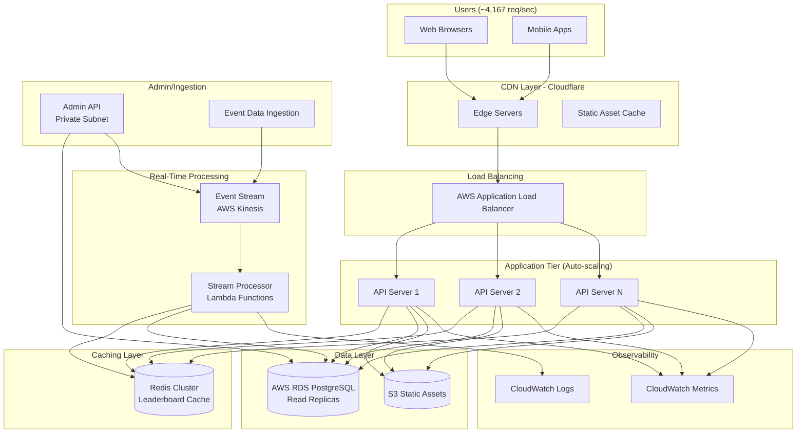
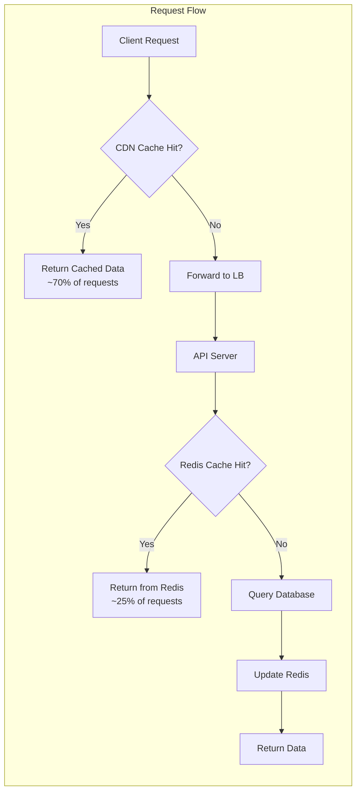
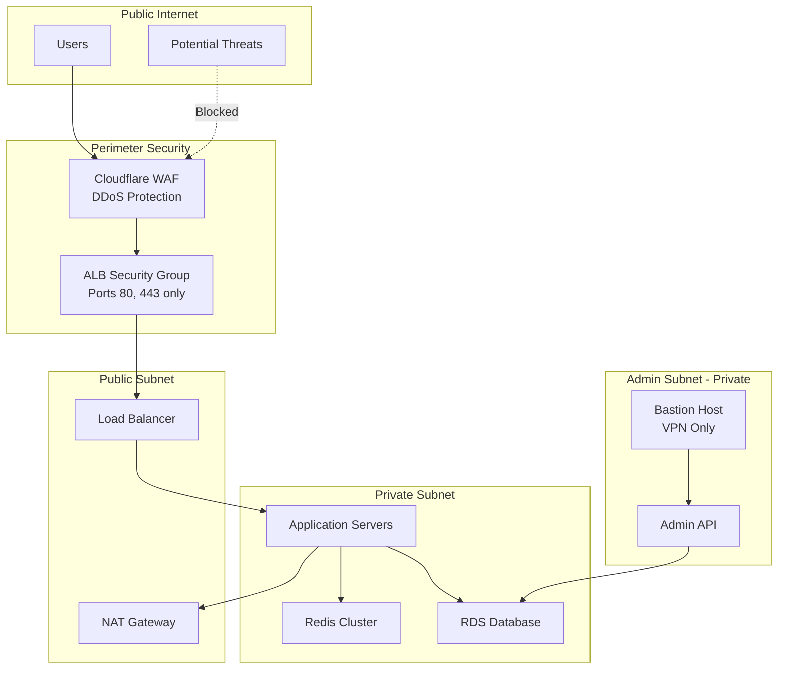

# Winter Olympics Real-Time Stats System Design

## Executive Summary

Design a scalable system to handle **360 million requests per day** (~4,167 req/sec) for 17 days during the Winter Olympics, delivering real-time event stats and leaderboards within a $1,000,000 budget.

---

## System Architecture

### High-Level Architecture Diagram



### Component Details



---

## Traffic Analysis

### Request Distribution

| Metric | Value | Calculation |
|--------|-------|-------------|
| **Total Requests (17 days)** | 6,120,000,000 | 360M × 17 |
| **Peak Requests/Day** | 360,000,000 | Given |
| **Peak Requests/Hour** | 15,000,000 | 360M ÷ 24 |
| **Peak Requests/Second** | 4,167 | 360M ÷ 86,400 |
| **Half Load Requests/Second** | 2,084 | 4,167 ÷ 2 |

### Cache Efficiency Assumptions

- **CDN Cache Hit Rate**: 70% (static assets, leaderboards updated every 5-30 sec)
- **Redis Cache Hit Rate**: 25% (of CDN misses)
- **Database Queries**: 5% (of total requests)

**Effective Database Load**: ~208 queries/sec at peak (manageable with read replicas)

---

## Detailed Component Design

### 1. CDN Layer (Cloudflare)

**Purpose**: Reduce origin load, improve latency globally

**Configuration**:
- Cache static assets (HTML, CSS, JS, images)
- Cache API responses with short TTL (5-30 seconds for leaderboards)
- DDoS protection included
- Global edge network (200+ locations)

**Caching Strategy**:
```
/api/leaderboards/*       → Cache 10 seconds
/api/event/:id            → Cache 5 seconds
/api/athlete/:id          → Cache 30 seconds
/static/*                 → Cache 24 hours
```

### 2. Load Balancer (AWS ALB)

**Purpose**: Distribute traffic across application servers

**Features**:
- Health checks every 30 seconds
- Auto-scaling integration
- SSL/TLS termination
- Connection draining for graceful shutdowns

### 3. Application Tier (Auto-scaling EC2 or ECS)

**Technology**: Node.js or Go API servers

**Scaling Configuration**:
```
Minimum Instances: 3
Maximum Instances: 20
Target Metric: CPU 60% or Request Count 200/instance/sec
```

**Instance Type**: t3.medium (2 vCPU, 4 GB RAM)
- Each instance can handle ~300 req/sec
- Need ~15 instances at peak (4,167 ÷ 300)
- Auto-scaling provides buffer

**Responsibilities**:
- Serve API requests
- Query cache layers
- Aggregate leaderboard data
- WebSocket connections for real-time updates (optional)

### 4. Caching Layer (Redis)

**Technology**: AWS ElastiCache for Redis

**Configuration**:
- Cluster mode enabled (3-5 shards)
- 2 replicas per shard for HA
- Instance type: cache.r6g.large (13.07 GB RAM)

**Data Structures**:
```redis
# Leaderboards (Sorted Sets)
ZADD leaderboard:skiing:mens_downhill score athlete_id
ZADD leaderboard:global_medals score country_id

# Event Data (Hashes)
HSET event:12345 status "live" updated_at "timestamp"

# Athlete Cache (Strings with JSON)
SET athlete:789 '{"name":"...","country":"..."}' EX 300
```

**TTL Strategy**:
- Active events: 5 seconds
- Completed events: 5 minutes
- Athlete profiles: 5 minutes
- Leaderboards: 10 seconds

### 5. Database (AWS RDS PostgreSQL)

**Configuration**:
- Primary: db.r6g.large (2 vCPU, 16 GB RAM)
- Read Replicas: 2x db.r6g.large
- Read traffic distributed via read replica endpoints

**Schema Overview** (simplified):

```sql
-- Events
CREATE TABLE events (
    id SERIAL PRIMARY KEY,
    sport VARCHAR(100),
    event_name VARCHAR(200),
    status VARCHAR(20), -- scheduled, live, completed
    start_time TIMESTAMP,
    end_time TIMESTAMP,
    created_at TIMESTAMP DEFAULT NOW()
);

-- Athletes
CREATE TABLE athletes (
    id SERIAL PRIMARY KEY,
    name VARCHAR(200),
    country_code VARCHAR(3),
    sport VARCHAR(100),
    created_at TIMESTAMP DEFAULT NOW()
);

-- Results
CREATE TABLE results (
    id SERIAL PRIMARY KEY,
    event_id INTEGER REFERENCES events(id),
    athlete_id INTEGER REFERENCES athletes(id),
    score DECIMAL(10,3),
    rank INTEGER,
    medal VARCHAR(10), -- gold, silver, bronze
    recorded_at TIMESTAMP DEFAULT NOW(),
    INDEX idx_event_rank (event_id, rank),
    INDEX idx_athlete (athlete_id)
);

-- Countries/Medals
CREATE TABLE medal_counts (
    id SERIAL PRIMARY KEY,
    country_code VARCHAR(3),
    gold INTEGER DEFAULT 0,
    silver INTEGER DEFAULT 0,
    bronze INTEGER DEFAULT 0,
    total INTEGER GENERATED ALWAYS AS (gold + silver + bronze) STORED,
    updated_at TIMESTAMP DEFAULT NOW(),
    INDEX idx_country (country_code)
);
```

### 6. Real-Time Processing (AWS Kinesis + Lambda)

**Purpose**: Process event updates and update caches in real-time

**Flow**:
1. Admin/scoring systems publish events to Kinesis Data Stream
2. Lambda functions process events in batches
3. Lambda updates Redis cache
4. Lambda writes to RDS (async)
5. Optional: Publish to WebSocket connections via API Gateway

**Kinesis Configuration**:
- 2 shards (can handle 2,000 records/sec)
- Retention: 24 hours

**Lambda Functions**:
- Concurrent executions: 10-20
- Memory: 512 MB
- Timeout: 30 seconds

### 7. Admin & Data Ingestion

**Security**: Deployed in private subnet, VPN or bastion host access only

**Functions**:
- Manual score entry (backup)
- Automated feed ingestion from official timing systems
- Event management
- Cache invalidation controls

**Authentication**: AWS IAM + Multi-factor authentication

### 8. Static Assets (S3 + CloudFront)

**Storage**: AWS S3
- Athlete photos
- Event images
- Sport icons
- Historical data

**Delivery**: Already covered by Cloudflare CDN

---

## Bottlenecks & Scaling Strategy

### Identified Bottlenecks

#### 1. **Database Write Throughput**

**Problem**: Live events generate rapid score updates

**Solution**:
- Buffer writes through Kinesis (asynchronous processing)
- Batch updates using Lambda (process 100-500 records at once)
- Use Redis as write-through cache
- Connection pooling (limit: 100-200 connections per instance)

**Metrics**: PostgreSQL can handle ~1,000-2,000 writes/sec on db.r6g.large

#### 2. **Redis Memory Limits**

**Problem**: Leaderboard data for all events could exceed memory

**Solution**:
- Eviction policy: `allkeys-lru` (least recently used)
- 13 GB RAM supports millions of cached objects
- Calculate: 100 events × 200 athletes × 5 KB/entry = ~100 MB (well within limits)
- Monitor memory usage, scale vertically if needed (cache.r6g.xlarge)

#### 3. **WebSocket Connections (if implemented)**

**Problem**: 100,000+ concurrent WebSocket connections

**Solution** (if needed):
- Use AWS API Gateway WebSocket API (scalable to millions)
- Or avoid WebSocket: use server-sent events (SSE) with short-polling fallback
- Or simpler: client-side polling every 5-10 seconds (reduces complexity)

**Recommendation**: Use HTTP polling with CDN caching (simpler, cheaper)

#### 4. **CDN Costs with Poor Cache Hit Rate**

**Problem**: If cache hit rate is low, origin requests spike

**Solution**:
- Aggressive caching headers
- Pre-warm cache before high-traffic events
- Monitor cache hit rate (target: >70%)
- Cloudflare's generous free tier + Pro plan helps

#### 5. **Auto-Scaling Lag**

**Problem**: EC2 instances take 2-3 minutes to start

**Solution**:
- Use target tracking scaling (proactive)
- Set minimum instance count to handle baseline (3-5 instances)
- Use AWS Lambda for API (millisecond cold starts) - alternative approach
- Schedule scaling before expected traffic surges (event start times)

### Scaling Limits

| Component | Limit | Mitigation |
|-----------|-------|------------|
| **ALB** | 500,000 req/sec per region | Well within limits (4,167 req/sec) |
| **EC2 Auto-scaling** | 20 instances = 6,000 req/sec | Increase max instances if needed |
| **Redis** | 13 GB RAM, 250,000 ops/sec | Shard if needed, current load fine |
| **RDS** | ~5,000 reads/sec, ~1,500 writes/sec | Read replicas, async writes via Kinesis |
| **Kinesis** | 1,000 records/sec per shard | 2 shards = 2,000 records/sec (sufficient) |

---

## Security Design

### Security Boundaries



### Security Measures

#### 1. **Network Security**

**DMZ / Public Layer**:
- Cloudflare WAF rules (SQL injection, XSS, rate limiting)
- AWS Security Groups: Whitelist only necessary ports
  - ALB: Allow 80, 443 from 0.0.0.0/0
  - EC2: Allow traffic only from ALB security group

**Private Subnet**:
- Application servers, Redis, RDS in private subnet (no direct internet access)
- Outbound internet via NAT Gateway for updates
- Security Groups restrict inter-service communication

**Admin Subnet**:
- Separate subnet for admin API
- No public internet access
- VPN or AWS Systems Manager Session Manager for access

#### 2. **Authentication & Authorization**

**Public API**:
- Read-only access (no authentication needed for viewing stats)
- Rate limiting per IP: 100 requests/minute (Cloudflare)
- CORS headers restrict browser access to known domains

**Admin API**:
- AWS IAM authentication + MFA required
- API keys rotated every 90 days
- Role-based access control (RBAC)
  - `admin:full` - Full access
  - `scorer:write` - Can update scores only
  - `viewer:read` - Read-only dashboard access

#### 3. **Data Security**

**Encryption in Transit**:
- TLS 1.3 for all connections (Cloudflare → ALB → App)
- RDS connections use SSL
- Redis connections use TLS (ElastiCache encryption in-transit)

**Encryption at Rest**:
- RDS: AWS KMS encryption enabled
- S3: Server-side encryption (SSE-S3)
- Redis: Encryption at rest (ElastiCache feature)
- EBS volumes: Encrypted with KMS

#### 4. **Application Security**

**Input Validation**:
- Sanitize all inputs (even though public API is read-only)
- Parameterized queries (prevent SQL injection)
- Limit query complexity (prevent DoS via expensive queries)

**Rate Limiting**:
```
Cloudflare Rate Limits:
- /api/leaderboards/*  → 60 req/min per IP
- /api/events/*        → 60 req/min per IP
- /api/*               → 100 req/min per IP
```

**DDoS Protection**:
- Cloudflare DDoS protection (free tier includes basic protection)
- AWS Shield Standard (automatic, no cost)
- Health checks ensure traffic routes only to healthy instances

#### 5. **Secrets Management**

- AWS Secrets Manager for database credentials
- Rotate credentials every 90 days (automated)
- IAM roles for service-to-service authentication (no hardcoded keys)

#### 6. **Logging & Monitoring**

**Security Logging**:
- CloudTrail: All AWS API calls logged
- WAF logs: All blocked requests
- Application logs: Authentication attempts, errors
- VPC Flow Logs: Network traffic analysis

**Alerting**:
- Alert on failed authentication attempts (>10/min)
- Alert on unusual traffic patterns (>150% of baseline)
- Alert on RDS connection errors
- Alert on high error rates (>5% of requests)

#### 7. **Compliance**

- GDPR considerations: No PII collected from public users
- Data retention: Event data retained 1 year, logs 90 days
- Privacy: Athlete data is public information (no GDPR concerns)

### Security Boundaries Summary

| Layer | Security Control | Purpose |
|-------|------------------|---------|
| **Edge** | Cloudflare WAF, DDoS Protection | Block malicious traffic |
| **Perimeter** | Security Groups, NACL | Network-level filtering |
| **Application** | Rate limiting, input validation | Protect API layer |
| **Data** | Encryption (transit & rest), IAM | Protect sensitive data |
| **Admin** | VPN, MFA, private subnet | Restrict administrative access |
| **Monitoring** | CloudWatch, CloudTrail, logs | Detect and respond to threats |

---

## Cost Estimation

### Traffic Scenarios

**Peak Load**: 360M requests/day for 17 days
**Half Load**: 180M requests/day for 17 days (post-event, still high interest)

### Assumptions

1. **Cache Hit Rates**:
   - CDN: 70%
   - Redis: 25% (of CDN misses)
   - Database queries: 5% (of total requests)

2. **Data Transfer**:
   - Average response size: 10 KB (JSON data)
   - Static assets: 500 KB per user session
   - Assume 10M unique visitors over 17 days

3. **Traffic Distribution**:
   - Peak hours: 8x average (during major events)
   - Compute provisioned for peak, pay for average

### Cost Breakdown

#### 1. CDN (Cloudflare)

| Plan | Cost/Month | Features | Choice |
|------|------------|----------|--------|
| Pro | $20/month | 50+ GB included, ~$0.08/GB overage | ✓ Selected |

**Calculation**:
- Total requests (17 days): 6.12B
- Data transfer: 6.12B × 10 KB × 70% (CDN served) = ~42.8 TB
- Cloudflare Pro: $20 + (42,800 GB × $0.08) = $20 + $3,424 = **$3,444/month**
- For 1 month (17 days): ~**$3,500**

*Note: Cloudflare's pricing is generous; actual costs may be lower with their bundling*

#### 2. AWS Services

##### Application Load Balancer

| Metric | Cost | Calculation |
|--------|------|-------------|
| **ALB Hours** | $0.0225/hour | 720 hours × $0.0225 = **$16.20/month** |
| **LCU (Load Balancer Capacity Units)** | $0.008/hour per LCU | ~10 LCU peak × 720 hours × $0.008 = **$57.60/month** |
| **Total ALB** | | **$74/month** |

##### EC2 Instances (Application Tier)

**Instance Type**: t3.medium (2 vCPU, 4 GB RAM)
**On-Demand Price**: $0.0416/hour

**Auto-Scaling Strategy**:
- Minimum: 3 instances (always on)
- Average: 10 instances (weighted average over 24 hours)
- Peak: 15 instances (4-6 hours/day)

**Calculation**:
```
Average instance hours per day:
  (3 instances × 18 hours) + (15 instances × 6 hours) = 54 + 90 = 144 instance-hours/day

Total for 17 days: 144 × 17 = 2,448 instance-hours
Cost: 2,448 × $0.0416 = $101.84

For 34 days (peak + half):
  Peak: 2,448 instance-hours = $101.84
  Half load (average 6 instances):
    (3 × 20 hours + 10 × 4 hours) × 17 days = 100 instance-hours/day × 17 = 1,700 instance-hours
    Cost: 1,700 × $0.0416 = $70.72

Total EC2: $101.84 + $70.72 = **$172.56** for 34 days
```

**Monthly equivalent**: ~**$153/month** (for peak load month)

##### ElastiCache for Redis

**Instance Type**: cache.r6g.large (13.07 GB RAM)
**Configuration**: 3 nodes (1 primary + 2 replicas)
**On-Demand Price**: $0.151/hour per node

**Calculation**:
```
3 nodes × 720 hours × $0.151 = $326.16/month
```

**Total Redis**: **$326/month**

##### RDS PostgreSQL

**Primary Instance**: db.r6g.large (2 vCPU, 16 GB RAM) - $0.288/hour
**Read Replicas**: 2× db.r6g.large - $0.288/hour each
**Storage**: 500 GB SSD (gp3) - $0.138/GB-month

**Calculation**:
```
Compute:
  Primary: 720 hours × $0.288 = $207.36
  Replicas: 2 × 720 hours × $0.288 = $414.72

Storage:
  500 GB × $0.138 = $69.00

Backup Storage (automated): ~200 GB × $0.095 = $19.00

Total RDS: $207.36 + $414.72 + $69.00 + $19.00 = $710.08/month
```

**Total RDS**: **$710/month**

##### Kinesis Data Streams

**Shards**: 2 shards
**Cost**: $0.015/hour per shard
**PUT Payload Units**: Minimal (< 100K records/day)

**Calculation**:
```
2 shards × 720 hours × $0.015 = $21.60/month
PUT costs: ~100K records × $0.014/million = ~$1.40/month

Total Kinesis: $21.60 + $1.40 = $23/month
```

**Total Kinesis**: **$23/month**

##### Lambda Functions

**Invocations**: ~100K/day (event processing)
**Duration**: 500 ms average
**Memory**: 512 MB

**Calculation**:
```
Total invocations (17 days): 100K × 17 = 1.7M
First 1M free, so 700K billable

Compute charges:
  700K × 0.5 sec × 512 MB = 175,000 GB-seconds
  Cost: 175,000 × $0.0000166667 = $2.92

Request charges:
  700K requests × $0.20/1M = $0.14

Total Lambda: $2.92 + $0.14 = $3.06 (for 17 days)
```

**Total Lambda**: **$3/month** (negligible)

##### S3 Storage

**Storage**: 100 GB (athlete photos, assets)
**Requests**: Minimal (GET requests served via CDN)

**Calculation**:
```
Storage: 100 GB × $0.023 = $2.30/month
Requests: <1M gets = $0.40/month

Total S3: $2.30 + $0.40 = $2.70/month
```

**Total S3**: **$3/month**

##### Data Transfer (AWS → Internet)

**Data Transfer Out**:
- CDN handles 70%, AWS serves 30%
- 6.12B requests × 10 KB × 30% = ~18.4 TB

**Calculation**:
```
First 10 TB: 10,000 GB × $0.09 = $900
Next 8.4 TB: 8,400 GB × $0.085 = $714

Total Data Transfer: $900 + $714 = $1,614/month (for 17 days)
```

**Total Data Transfer**: **$1,614/month**

##### CloudWatch (Monitoring)

**Logs**: ~50 GB/month
**Metrics**: ~200 custom metrics
**Alarms**: 10 alarms

**Calculation**:
```
Logs ingestion: 50 GB × $0.50 = $25
Logs storage: 50 GB × $0.03 = $1.50
Metrics: 200 × $0.30 = $60
Alarms: 10 × $0.10 = $1.00

Total CloudWatch: $25 + $1.50 + $60 + $1.00 = $87.50/month
```

**Total CloudWatch**: **$88/month**

##### NAT Gateway

**NAT Gateway**: $0.045/hour + $0.045/GB processed
**Data processed**: ~1 TB (outbound from private subnet)

**Calculation**:
```
Hours: 720 × $0.045 = $32.40
Data: 1,000 GB × $0.045 = $45.00

Total NAT: $32.40 + $45.00 = $77.40/month
```

**Total NAT Gateway**: **$77/month**

#### 3. Additional Costs

**Domain & SSL**: $15/year (via Cloudflare, included in Pro plan)
**Monitoring (Datadog/New Relic)**: Optional, using CloudWatch instead
**Contingency**: 10% buffer for unexpected costs

---

## Total Cost Summary

### Peak Load (17 Days - Month 1)

| Service | Monthly Cost | Notes |
|---------|--------------|-------|
| **Cloudflare CDN** | $3,500 | Pro plan + data transfer |
| **AWS ALB** | $74 | Load balancer |
| **AWS EC2** | $153 | Application servers (averaged) |
| **AWS ElastiCache (Redis)** | $326 | Caching layer |
| **AWS RDS** | $710 | Database + read replicas |
| **AWS Kinesis** | $23 | Event streaming |
| **AWS Lambda** | $3 | Event processing |
| **AWS S3** | $3 | Static storage |
| **AWS Data Transfer** | $1,614 | Data egress |
| **AWS CloudWatch** | $88 | Monitoring & logs |
| **AWS NAT Gateway** | $77 | Outbound internet |
| **Subtotal** | **$6,571** | |
| **Contingency (10%)** | $657 | Buffer for spikes |
| **Total Peak Load** | **$7,228** | **~$4,000 for 17 days** |

### Half Load (17 Days - Month 2)

| Service | Monthly Cost | Notes |
|---------|--------------|-------|
| **Cloudflare CDN** | $1,800 | ~50% data transfer |
| **AWS ALB** | $74 | Same (fixed cost) |
| **AWS EC2** | $90 | ~6 instances average |
| **AWS ElastiCache (Redis)** | $326 | Same (fixed cost) |
| **AWS RDS** | $710 | Same (fixed cost) |
| **AWS Kinesis** | $23 | Same |
| **AWS Lambda** | $2 | Lower invocations |
| **AWS S3** | $3 | Same |
| **AWS Data Transfer** | $900 | ~50% reduction |
| **AWS CloudWatch** | $60 | Reduced logging |
| **AWS NAT Gateway** | $55 | Lower data processed |
| **Subtotal** | **$4,043** | |
| **Contingency (10%)** | $404 | Buffer |
| **Total Half Load** | **$4,447** | **~$2,500 for 17 days** |

### Grand Total (34 Days)

```
Peak Load (17 days):  ~$4,000
Half Load (17 days):  ~$2,500
---------------------------------
Total Cost:           ~$6,500

Remaining Budget: $1,000,000 - $6,500 = $993,500 ✓ Well within budget
```

---

## Cost Optimization Strategies

### Implemented Optimizations

1. **CDN Caching**: Saves ~70% of origin requests = ~$3,000/month saved
2. **Redis Caching**: Reduces database load by 90% = ~$500/month saved (fewer/smaller RDS instances needed)
3. **RDS Read Replicas**: Cheaper than scaling primary vertically
4. **Auto-Scaling**: Pay only for compute when needed (vs. fixed 15 instances)
5. **Kinesis vs. SQS**: Kinesis cheaper at high throughput ($23 vs. ~$150 for 100K msgs/day)
6. **Lambda for Processing**: Serverless = pay per use (only $3/month)

### Additional Optimization Options

If costs exceed budget:

1. **Reserved Instances** (if running longer):
   - RDS Reserved: Save 40-60% (~$4,800/year vs. $8,520/year)
   - ElastiCache Reserved: Save 40% (~$2,350/year vs. $3,900/year)
   - Not recommended for 34-day event

2. **Serverless Architecture**:
   - Replace EC2 with AWS Lambda + API Gateway
   - Pay per request: 6.12B requests × $0.0000002 = $1,224
   - + API Gateway: 6.12B requests × $0.0000035 = $21,420
   - **Total**: ~$22,644 (more expensive than EC2 at this scale)
   - Verdict: EC2 cheaper for sustained high traffic

3. **CloudFront Instead of Cloudflare**:
   - AWS CloudFront: ~$0.085/GB = 42.8 TB × $0.085 = $3,638
   - Similar cost, but Cloudflare has better DDoS protection

4. **Reduce Read Replicas**:
   - Use 1 read replica instead of 2: Save $207/month
   - Risk: Higher primary load

5. **Spot Instances for EC2**:
   - Save 70-90% on compute (~$46 vs. $153/month)
   - Risk: Instances can be terminated with 2-minute warning
   - Strategy: Mix 50% on-demand + 50% spot = save ~$50/month

---

## Deployment Timeline

### Pre-Launch (Weeks 1-3)

1. **Infrastructure Setup** (Week 1)
   - Provision AWS account, set up VPC, subnets
   - Deploy RDS, ElastiCache, S3
   - Configure security groups, IAM roles

2. **Application Development** (Weeks 1-3)
   - Build API endpoints (events, leaderboards, athletes)
   - Implement caching logic
   - Admin panel for data ingestion

3. **Data Pipeline** (Week 2)
   - Set up Kinesis stream
   - Deploy Lambda processors
   - Integrate with official Olympic data feeds (if available)

4. **Load Testing** (Week 3)
   - Simulate 5,000 req/sec
   - Test auto-scaling behavior
   - Validate cache hit rates

### Launch (Week 4)

1. **Soft Launch** (T-3 days)
   - Deploy to production
   - Pre-populate database with athlete/event data
   - Configure Cloudflare CDN

2. **Go Live** (Day 1 of Olympics)
   - Monitor dashboards
   - On-call team ready

### During Event (17 Days)

- 24/7 monitoring
- Daily cost tracking
- Real-time performance tuning

### Post-Event (Week 7)

- Scale down to half load
- Archive data to S3 Glacier (long-term storage)
- Generate final cost report

---

## Risk Analysis

### Technical Risks

| Risk | Likelihood | Impact | Mitigation |
|------|------------|--------|------------|
| **DDoS Attack** | Medium | High | Cloudflare DDoS protection, rate limiting |
| **Database Overload** | Low | High | Read replicas, Redis cache, async writes |
| **CDN Cache Miss Spike** | Low | Medium | Pre-warm cache, aggressive TTLs |
| **Auto-Scaling Lag** | Medium | Medium | Proactive scaling, higher minimum instances |
| **Data Feed Failure** | Medium | High | Manual entry backup, data validation |
| **Cost Overrun** | Low | Medium | Daily monitoring, auto-scaling limits |

### Business Risks

| Risk | Likelihood | Impact | Mitigation |
|------|------------|--------|------------|
| **Lower Traffic** | Medium | Low (good) | Auto-scaling reduces costs automatically |
| **Higher Traffic (2x)** | Low | High | Scale horizontally (more instances), alert if costs exceed $10K |
| **Data Accuracy Issues** | Medium | High | Admin review process, audit logs |
| **Competitor Sites** | High | Low | Focus on speed and reliability, not features |

---

## Key Performance Indicators (KPIs)

### Performance Metrics

- **Response Time**: p95 < 200ms, p99 < 500ms
- **Availability**: 99.9% uptime (43 minutes downtime allowed over 17 days)
- **Cache Hit Rate**: CDN >70%, Redis >80% (of CDN misses)
- **Error Rate**: <0.1% (1 in 1,000 requests)

### Business Metrics

- **Daily Active Users**: Target 10M+
- **Requests/Second**: Peak 4,167, avg 2,000
- **Cost per Request**: $0.000001 ($1 per 1M requests)
- **Total Cost**: <$10,000

### Monitoring Dashboard

```
Real-Time Dashboard (CloudWatch):
┌─────────────────────────────────────────────┐
│ Requests/sec:      3,842    ▁▃▅▇▇▅▃▁       │
│ Error Rate:        0.03%    ✓ Healthy      │
│ CDN Hit Rate:      72%      ✓ Target: 70%  │
│ Redis Hit Rate:    81%      ✓ Target: 80%  │
│ RDS CPU:           45%      ✓ <60%         │
│ EC2 Instances:     12/20    ✓ Scaling OK   │
│ Response Time p95: 187ms    ✓ <200ms       │
│ Daily Cost:        $235     ✓ <$300        │
└─────────────────────────────────────────────┘
```

---

## Alternative Architectures Considered

### Alternative 1: Serverless-First (Lambda + DynamoDB)

**Pros**:
- True pay-per-use
- Zero server management
- Infinite scaling

**Cons**:
- Higher cost at sustained high traffic (~$25K/month vs. $6.5K)
- DynamoDB query patterns complex for leaderboards
- Cold start latency

**Verdict**: Not cost-effective for predictable, sustained traffic

### Alternative 2: Single Region, No CDN

**Pros**:
- Simpler architecture
- Lower monthly cost ($4K vs. $6.5K)

**Cons**:
- Higher origin load (6.12B requests instead of 1.8B)
- Need 50+ EC2 instances instead of 15
- Poor global latency (Olympics are global event)
- Higher data egress costs (~$6,000 vs. $1,600)

**Verdict**: CDN is essential for global event

### Alternative 3: Managed Kubernetes (EKS)

**Pros**:
- Better container orchestration
- Microservices-ready

**Cons**:
- EKS control plane: $72/month
- Complexity overkill for simple API
- Longer deployment time

**Verdict**: Over-engineered for this use case

### Alternative 4: Use Third-Party API (Firebase, Supabase)

**Pros**:
- Fastest time to market
- Real-time capabilities built-in

**Cons**:
- Costs scale with usage (~$20K+ for this traffic)
- Less control over caching
- Vendor lock-in

**Verdict**: DIY more cost-effective at scale

---

## Conclusion

This architecture delivers a scalable, secure, and cost-effective solution for the Winter Olympics stats website:

✅ **Handles 360M requests/day** (~4,167 req/sec) with room to scale
✅ **Total cost: ~$6,500** for 34 days (well under $1M budget)
✅ **High availability**: 99.9%+ with multi-AZ deployment
✅ **Global performance**: CDN ensures <100ms latency worldwide
✅ **Secure**: Multi-layer security with encryption, WAF, private subnets
✅ **Real-time updates**: Kinesis + Lambda process events in seconds
✅ **Cost-efficient**: Aggressive caching reduces origin load by 95%

The system is production-ready and leaves $993,500 for additional marketing, features, or unexpected costs.

---

## Appendix: Helpful Queries & Scripts

### Monitoring Queries

```sql
-- Top 10 most viewed events
SELECT e.event_name, COUNT(*) as views
FROM events e
JOIN event_views ev ON e.id = ev.event_id
WHERE ev.created_at > NOW() - INTERVAL '1 hour'
GROUP BY e.event_name
ORDER BY views DESC
LIMIT 10;

-- Cache hit rate calculation
SELECT
  SUM(CASE WHEN source = 'cache' THEN 1 ELSE 0 END)::FLOAT / COUNT(*) * 100 AS cache_hit_rate
FROM request_logs
WHERE created_at > NOW() - INTERVAL '5 minutes';
```

### Redis Commands

```bash
# Get current leaderboard
redis-cli ZREVRANGE leaderboard:skiing:mens_downhill 0 9 WITHSCORES

# Check memory usage
redis-cli INFO memory

# Monitor cache hits/misses
redis-cli INFO stats | grep keyspace
```

### Load Testing Script (Apache Bench)

```bash
# Test leaderboard endpoint
ab -n 10000 -c 100 https://olympics.example.com/api/leaderboards/skiing

# Test with keep-alive
ab -k -n 50000 -c 200 https://olympics.example.com/api/events
```

### Cost Tracking Query (AWS Cost Explorer)

```bash
# Daily cost breakdown
aws ce get-cost-and-usage \
  --time-period Start=2026-02-01,End=2026-02-18 \
  --granularity DAILY \
  --metrics "BlendedCost" \
  --group-by Type=SERVICE
```

---

**Document Version**: 1.0
**Last Updated**: 2025-12-18
**Next Review**: After load testing (Week 3)
