# Reliable Systems: Fault-Tolerant Distributed Architecture

## Learning Goals
- Learn how to keep a system running when nodes fail
- Understand trade-offs between consistency and availability

---

## Problem Statement

### Current System Architecture

**Setup:**
- Horizontally scaled system with multiple nodes
- Nodes arranged in a **ring topology** using **consistent hashing**
- Network load balancer distributes traffic
- Data partitioned across nodes based on hash key

**Current Problem:**
- **Frequency:** Node failures occur ~once every 3 months
- **Impact:** Downtime for both reads and writes when node fails
- **User Experience:** Service disruption, data temporarily unavailable
- **Business Impact:** Lost revenue, poor customer experience

**Goal:**
Design a system with **zero downtime** that allows reads and writes even when a single node fails.

---

## Current Architecture (Problem State)

### Consistent Hashing Ring Without Replication

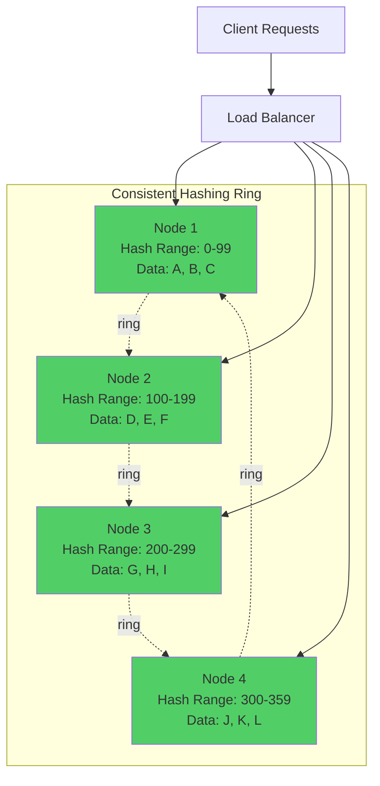

**How It Works:**
1. Data keys are hashed to determine which node stores them
2. Each node responsible for a range of hash values
3. Load balancer routes requests to appropriate node
4. **Single copy** of data stored on each node

**Failure Scenario:**

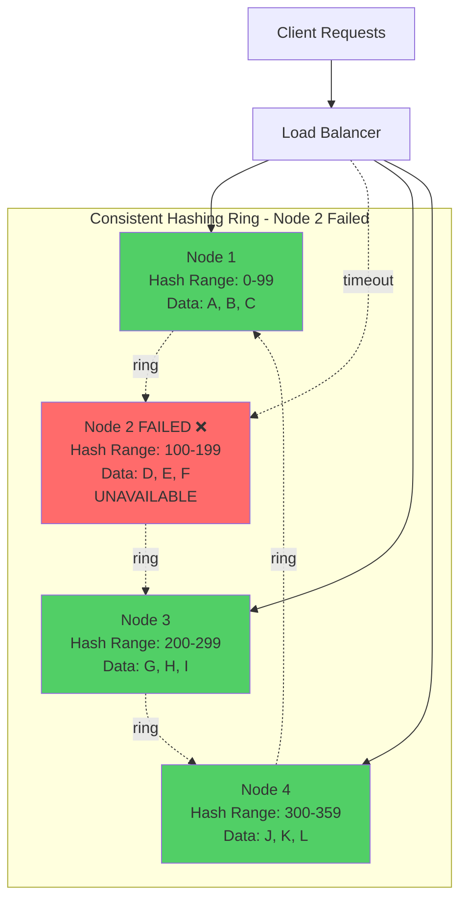

**Problem:**
- Data D, E, F on Node 2 becomes **completely unavailable**
- Requests for that data fail with timeouts or errors
- **25% of data inaccessible** (1 of 4 nodes down)
- Both reads and writes fail for affected keys

---

## Solution: Replication with Quorum Consensus

### Design Overview

**Key Principles:**
1. **Replication Factor (N):** Store multiple copies of each data item
2. **Quorum Reads (R):** Number of replicas that must respond for a read
3. **Quorum Writes (W):** Number of replicas that must acknowledge a write
4. **Consistency Rule:** R + W > N ensures consistency

**Standard Configuration:**
- **N = 3** (three replicas of each data item)
- **R = 2** (read from 2 replicas)
- **W = 2** (write to 2 replicas)
- **Property:** R + W = 4 > N = 3 (guarantees consistency)

---

### Replicated Ring Architecture

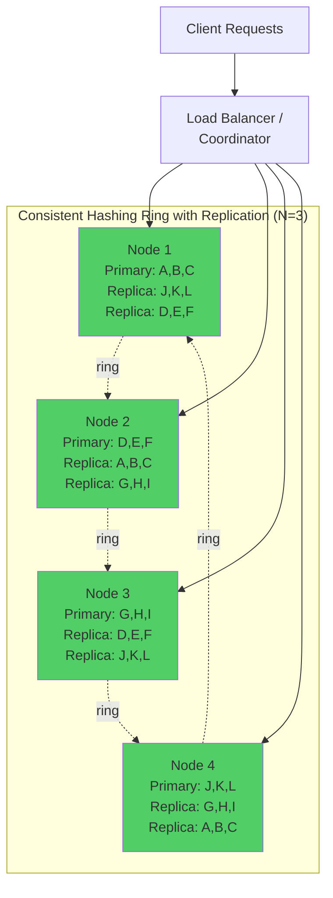

**Replication Strategy:**
- Each data item stored on **3 consecutive nodes** in the ring
- Primary node (based on hash) + 2 successors
- Example: Data "D" (hashes to Node 2)
  - **Primary:** Node 2
  - **Replica 1:** Node 3 (next in ring)
  - **Replica 2:** Node 4 (next after that)

---

### Write Path with Replication

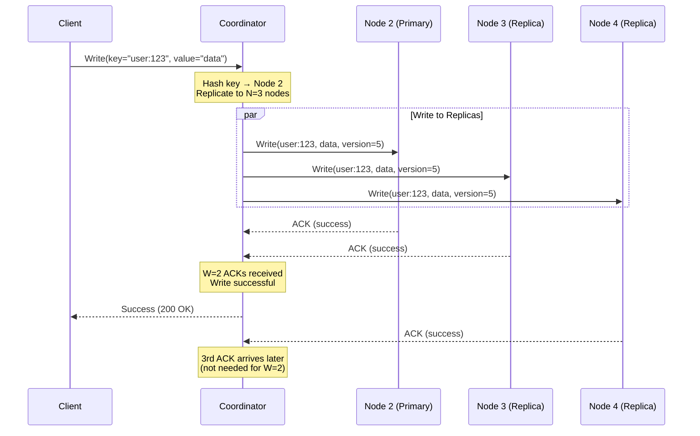

**Write Process:**
1. Client sends write request to coordinator (any node or load balancer)
2. Coordinator hashes key to find primary node
3. Coordinator sends write to **N=3 replicas** in parallel
4. Coordinator waits for **W=2** acknowledgments
5. Once W=2 ACKs received, return success to client
6. Third ACK may arrive later (async)

**Latency:** Determined by the 2nd-fastest replica (W=2)

---

### Read Path with Replication

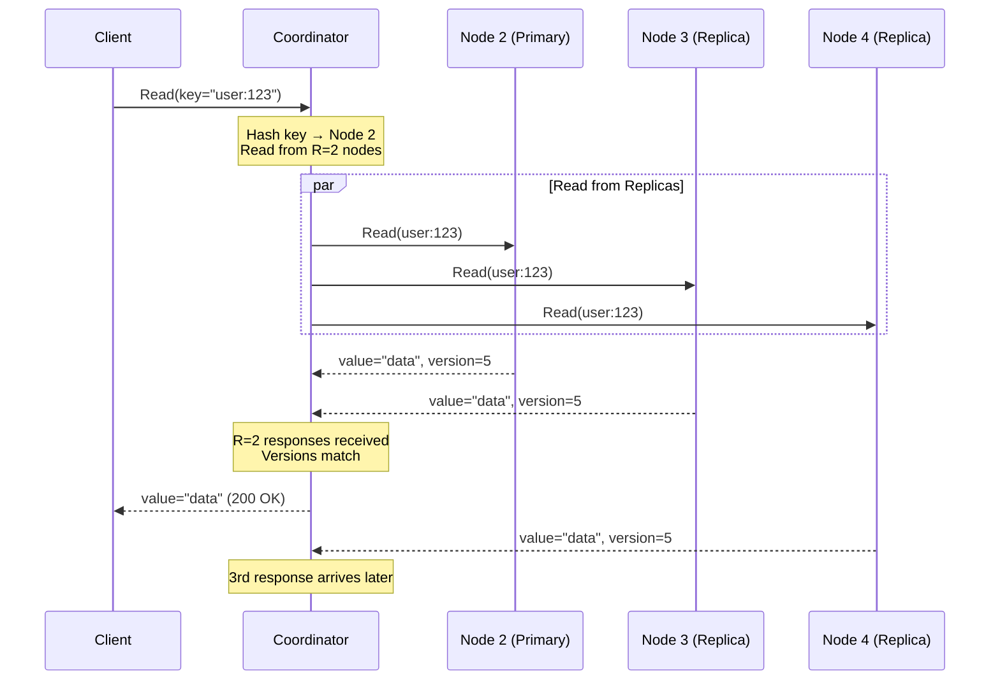

**Read Process:**
1. Client sends read request to coordinator
2. Coordinator hashes key to find replicas
3. Coordinator requests data from **R=2 replicas** (or all N=3)
4. Wait for **R=2** responses
5. Compare versions, return latest version to client
6. (Optional) Perform **read repair** if versions differ

**Latency:** Determined by the 2nd-fastest replica (R=2)

---

## Handling Node Failures

### Scenario: Node 2 Fails with Replication

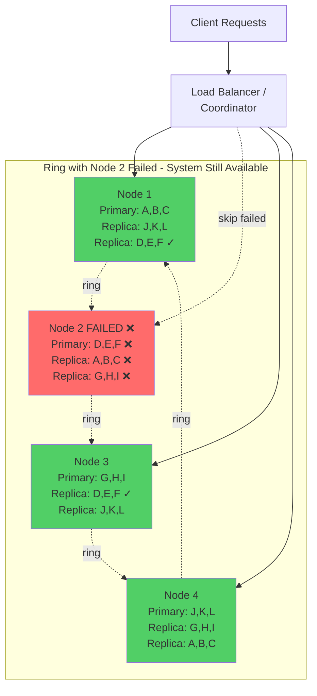

**System Behavior:**
- Data D, E, F still available on **Node 1 and Node 3**
- Coordinator detects Node 2 timeout/failure
- Reads and writes continue using remaining replicas
- **R=2 still achievable** with 2 of 3 replicas online
- **W=2 still achievable** with 2 of 3 replicas online
- **Zero downtime** for users

---

### Write During Node Failure

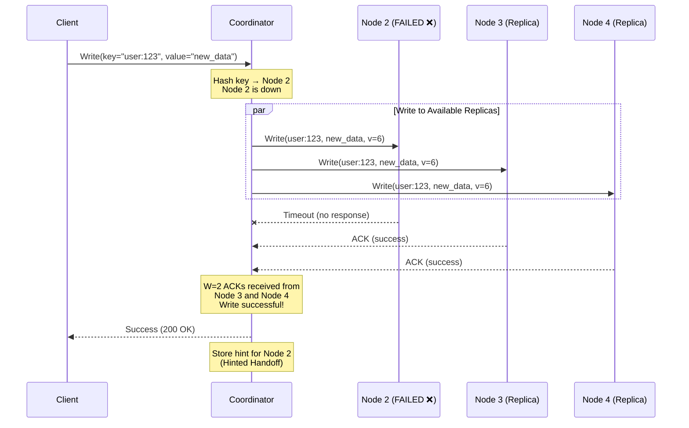

**Write Process During Failure:**
1. Coordinator attempts write to all N=3 replicas
2. Node 2 times out (failed)
3. Nodes 3 and 4 acknowledge successfully
4. **W=2 threshold met** → write succeeds
5. Coordinator stores **hinted handoff** for Node 2
6. Client receives success response

**Result:** Write succeeds despite node failure

---

### Read During Node Failure

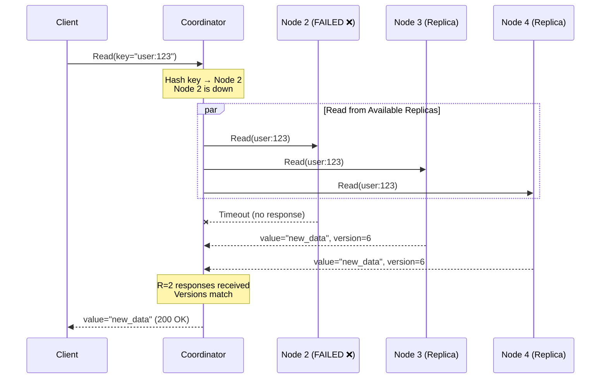

**Read Process During Failure:**
1. Coordinator attempts read from R=2 replicas (or all N=3)
2. Node 2 times out (failed)
3. Nodes 3 and 4 respond with data
4. **R=2 threshold met** → read succeeds
5. Return latest version to client

**Result:** Read succeeds despite node failure

---

## Recovery Mechanisms

### 1. Hinted Handoff

**Problem:** Node 2 was down during writes. How does it catch up?

**Solution:** Hinted Handoff

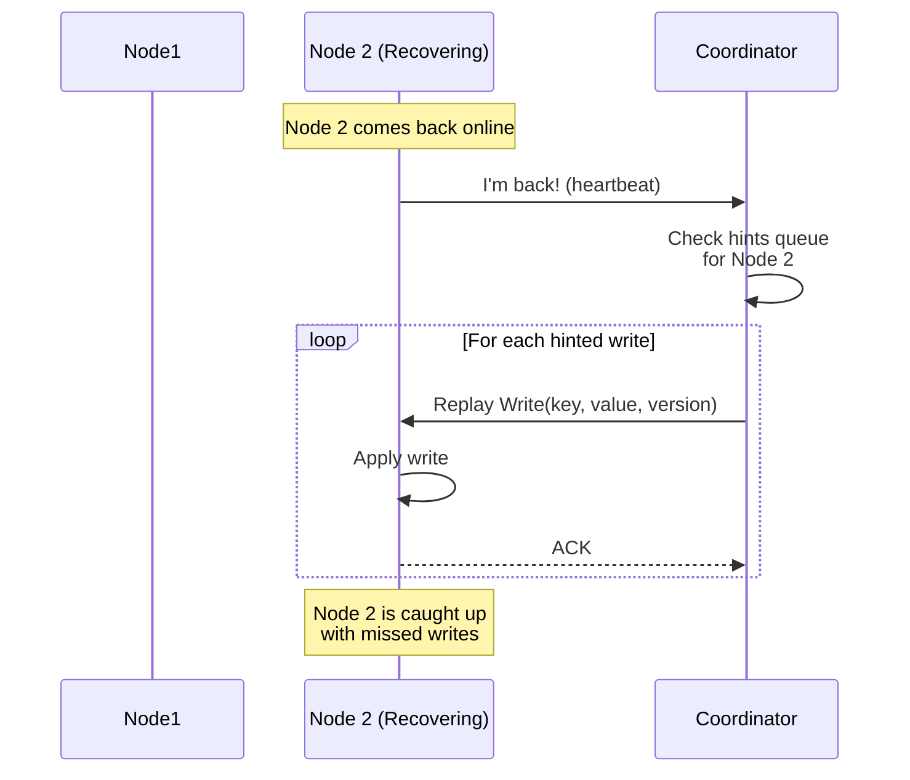

**How It Works:**
1. When Node 2 is down, coordinator stores **hints** (missed writes)
2. Hints stored temporarily on other nodes or coordinator
3. When Node 2 recovers, coordinator replays hints
4. Node 2 catches up on missed writes
5. After hints applied, Node 2 fully operational

**Benefits:**
- Fast recovery for recent failures
- Minimal network traffic

**Limitations:**
- Hints typically stored for limited time (e.g., 3 hours)
- Not suitable for long-term failures

---

### 2. Read Repair

**Problem:** Replicas may have different versions of data

**Solution:** Read Repair

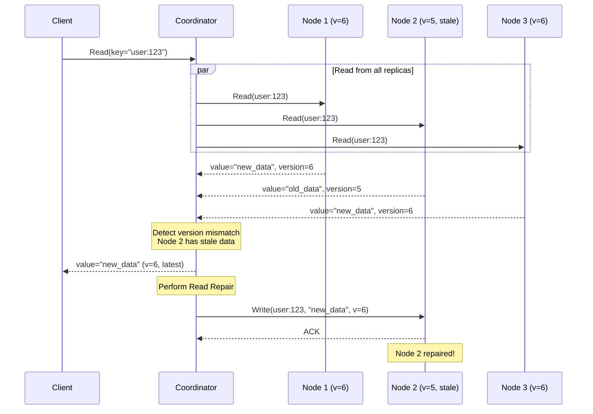

**How It Works:**
1. Read from all N=3 replicas (or R=2+)
2. Compare versions across responses
3. Return latest version to client
4. **Background:** Update stale replicas with latest version
5. Eventually all replicas converge

**Benefits:**
- Self-healing during normal operations
- No separate repair process needed
- Repairs discovered during reads

---

### 3. Anti-Entropy with Merkle Trees

**Problem:** Some inconsistencies may never be read (cold data)

**Solution:** Periodic Anti-Entropy Process

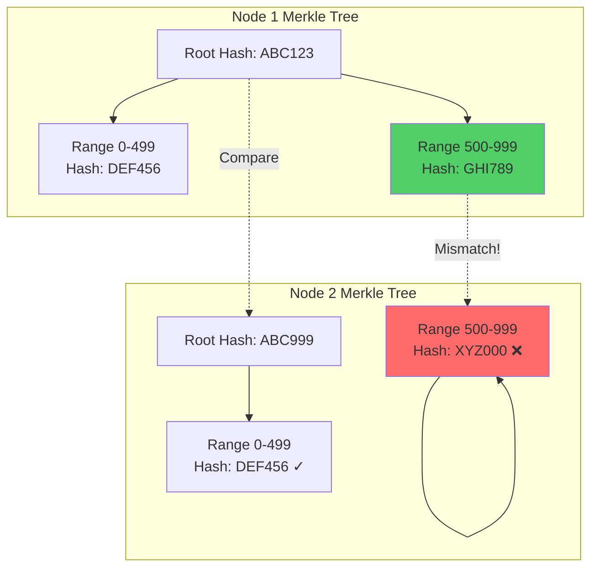

**How It Works:**
1. Each node maintains **Merkle tree** of its data
2. Merkle tree = hierarchical hash tree of key ranges
3. Periodically, nodes exchange root hashes
4. If roots differ, compare child hashes recursively
5. Identify specific key ranges with differences
6. Sync only the differing keys

**Example:**
```
Node 1 to Node 2 comparison:
1. Compare root hashes → MISMATCH
2. Compare left subtree (0-499) → MATCH (skip)
3. Compare right subtree (500-999) → MISMATCH
4. Drill down to find specific keys
5. Sync only keys in range 500-999
```

**Benefits:**
- Efficiently finds inconsistencies
- Minimizes data transfer (only sync differences)
- Catches issues that read repair misses

**Frequency:** Run hourly or daily

---

## Consistency vs Availability Trade-offs

### CAP Theorem Context

**CAP Theorem:** In a distributed system, you can only guarantee 2 of 3:
- **C**onsistency: All nodes see the same data at the same time
- **A**vailability: Every request receives a response
- **P**artition tolerance: System continues despite network failures

**Our Choice:** Prioritize **AP** (Availability + Partition tolerance)

---

### Consistency Models

#### 1. Strong Consistency (R + W > N)

**Configuration:** N=3, R=2, W=2 (R+W=4 > N=3)

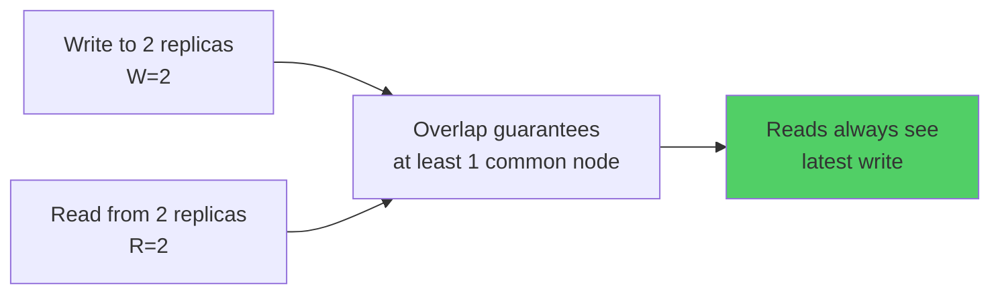

**Guarantee:** Read always returns latest write

**Trade-off:**
- ✓ Strong consistency
- ✗ Higher latency (must wait for 2 nodes)
- ✗ Lower availability (need 2 nodes for any operation)

**Use Cases:**
- Financial transactions
- Inventory systems
- User authentication

---

#### 2. Eventual Consistency (R + W ≤ N)

**Configuration:** N=3, R=1, W=1 (R+W=2 ≤ N=3)

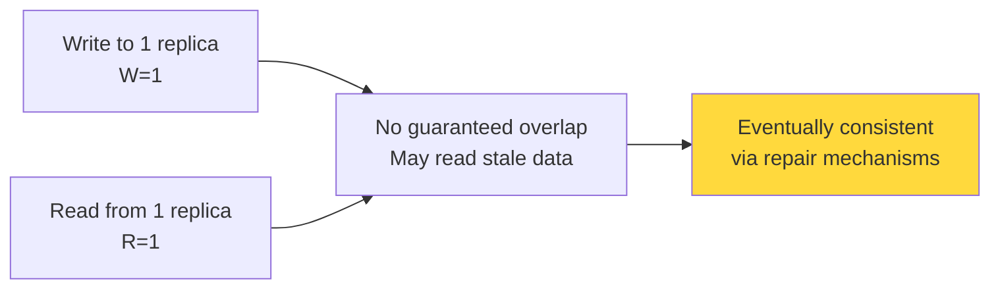

**Guarantee:** Reads will eventually see writes (no immediate guarantee)

**Trade-off:**
- ✓ Lower latency (wait for just 1 node)
- ✓ Higher availability (only need 1 node)
- ✗ Possible stale reads

**Use Cases:**
- Social media feeds
- Product catalogs
- Analytics data
- DNS records

---

### Configuration Comparison Table

| Config | N | R | W | R+W vs N | Consistency | Availability | Latency | Can Tolerate Failures |
|--------|---|---|---|----------|-------------|--------------|---------|----------------------|
| Strong | 3 | 3 | 1 | 4 > 3 | Strong | Low | High | 0 node failures |
| Strong | 3 | 2 | 2 | 4 > 3 | Strong | Medium | Medium | 1 node failure |
| Eventual | 3 | 1 | 1 | 2 ≤ 3 | Eventual | High | Low | 2 node failures |
| Eventual | 3 | 1 | 2 | 3 ≤ 3 | Eventual | High | Medium | 1 node failure |

**Recommended:** N=3, R=2, W=2 for most use cases (balance of consistency and availability)

---

## Performance Characteristics

### Latency Analysis

#### Normal Operation (All Nodes Healthy)

| Operation | Configuration | Latency | Bottleneck |
|-----------|--------------|---------|------------|
| Write | W=2, N=3 | 2nd-fastest node | 2nd percentile latency |
| Read | R=2, N=3 | 2nd-fastest node | 2nd percentile latency |

**Example:**
- Node 1 latency: 5ms
- Node 2 latency: 10ms
- Node 3 latency: 20ms
- **Write latency:** 10ms (wait for nodes 1 and 2)
- **Read latency:** 10ms (wait for nodes 1 and 2)

---

#### During Node Failure (1 of 3 Nodes Down)

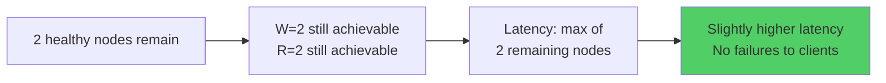

**Impact:**
- ✓ Reads/writes still succeed
- ✗ Latency increases (no fast node to fall back on)
- Must wait for both remaining nodes
- Typical increase: 10-30% higher latency

**Example:**
- Healthy nodes: 10ms and 20ms
- **Latency:** 20ms (must wait for slower node)

---

### Throughput Analysis

#### System Capacity

**Single Node Capacity:** 5,000 RPS
**Ring Size:** 4 nodes

**Without Replication:**
- Total capacity: 4 × 5,000 = 20,000 RPS
- Each node handles 1/4 of traffic

**With Replication (N=3):**
- Effective capacity: 4 × 5,000 / 3 = 6,666 RPS
- Each write hits 3 nodes (3x amplification)
- Each read hits 2 nodes (2x amplification for R=2)

**Write Amplification:**
```
Write throughput = Total node capacity / N
Write throughput = 20,000 RPS / 3 = 6,666 RPS
```

**Read Amplification:**
```
Read throughput = Total node capacity / R
Read throughput = 20,000 RPS / 2 = 10,000 RPS
```

---

## Scaling Considerations

### Adding Nodes to the Ring

**Scenario:** System grows from 4 to 8 nodes

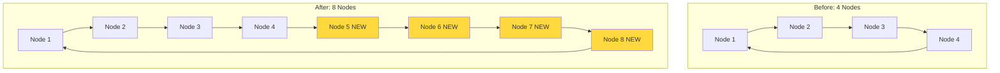

**Process:**
1. Add new nodes to ring
2. Rebalance hash ranges (consistent hashing)
3. Stream data to new nodes
4. Update routing tables
5. Remove old replicas (if needed)

**Impact:**
- Minimal data movement (consistent hashing property)
- System remains available during rebalance
- Gradual increase in capacity

**Data Movement:**
```
Data to move = Total data × (New nodes / Total nodes after)
Data to move = Total data × (4 / 8) = 50% of data moves
```

---

### Handling Increased Data Volume

**Strategy 1: Add More Nodes**
- Increases total capacity linearly
- Spreads data across more machines
- Maintains replication factor N=3

**Strategy 2: Increase Replication Factor**
- N=3 → N=5 (5 replicas per key)
- Higher durability and availability
- Trade-off: Higher storage cost, write amplification

**Strategy 3: Sharding by Key Range**
- Multiple independent rings
- Each ring handles subset of keyspace
- Example: Users A-M on Ring 1, N-Z on Ring 2

---

## Production Recommendations

### Monitoring and Alerts

**Key Metrics:**
```
1. Node Health
   - CPU usage
   - Memory usage
   - Disk I/O
   - Network latency

2. Replication Metrics
   - Replica lag (time behind primary)
   - Inconsistent replicas count
   - Hinted handoff queue size

3. Performance Metrics
   - Read latency (p50, p95, p99)
   - Write latency (p50, p95, p99)
   - Throughput (reads/sec, writes/sec)
   - Error rate (timeouts, failures)

4. Cluster Health
   - Number of healthy nodes
   - Number of under-replicated keys
   - Anti-entropy backlog size
```

**Critical Alerts:**
- 2+ nodes down (violates W=2 or R=2)
- Replica lag > 10 seconds
- Error rate > 0.1%
- Disk usage > 80%

---

### Configuration Tuning

**For Low-Latency Requirements:**
- N=3, R=1, W=1 (eventual consistency)
- Trade consistency for speed
- Use cases: Caching, session storage

**For High-Consistency Requirements:**
- N=5, R=3, W=3 (strong consistency)
- Can tolerate 2 node failures
- Use cases: Financial data, user accounts

**For High-Availability Requirements:**
- N=5, R=2, W=2 (balanced)
- Can tolerate 3 node failures
- Best for critical services

---

### Operational Best Practices

1. **Rolling Restarts**
   - Restart one node at a time
   - Wait for node to fully recover before next
   - Maintains availability during upgrades

2. **Capacity Planning**
   - Keep 30% headroom per node
   - Plan for 2-node failure scenario
   - Monitor growth trends weekly

3. **Backup Strategy**
   - Regular snapshots of each node
   - Off-site replicas in different datacenter
   - Test restore procedures monthly

4. **Disaster Recovery**
   - Document recovery procedures
   - Maintain node rebuild scripts
   - Practice failure scenarios quarterly

---

## Design Summary

### Final Architecture

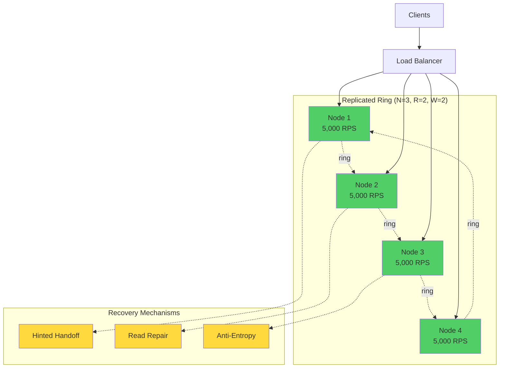

**Key Features:**
✓ **Zero downtime** during single node failure
✓ **Strong consistency** with R+W > N
✓ **Automatic recovery** via hinted handoff
✓ **Self-healing** through read repair
✓ **Eventual consistency** enforcement via anti-entropy
✓ **Horizontal scalability** via consistent hashing
✓ **Tunable trade-offs** between consistency and availability

---

### Questions Answered

| Consideration | Answer |
|--------------|--------|
| **Data Replication** | Store N=3 copies on consecutive nodes in ring |
| **Access During Failure** | R=2 and W=2 quorums allow operations with 2/3 nodes |
| **Consistency Trade-offs** | R+W>N ensures strong consistency, can tune for eventual |
| **Latency Impact** | Increases 10-30% during failure (wait for slower nodes) |
| **Node Rejoin** | Hinted handoff + read repair + anti-entropy |
| **Scaling** | Add nodes to ring, consistent hashing minimizes data movement |

---

## Conclusion

By implementing **replication (N=3)** with **quorum consensus (R=2, W=2)** and **multiple recovery mechanisms**, we achieve:

1. **Zero Downtime:** System survives single node failure
2. **Strong Consistency:** Reads always see latest writes (R+W>N)
3. **High Availability:** 99.9%+ uptime even with regular failures
4. **Automatic Recovery:** Self-healing through hinted handoff and repairs
5. **Horizontal Scalability:** Add nodes as data/traffic grows

**Cost:**
- 3x storage overhead (N=3 replication)
- 2-3x write amplification
- Slightly higher latency (wait for 2 nodes)

**Result:** Robust, production-ready distributed system that remains available despite node failures while maintaining strong consistency guarantees.
