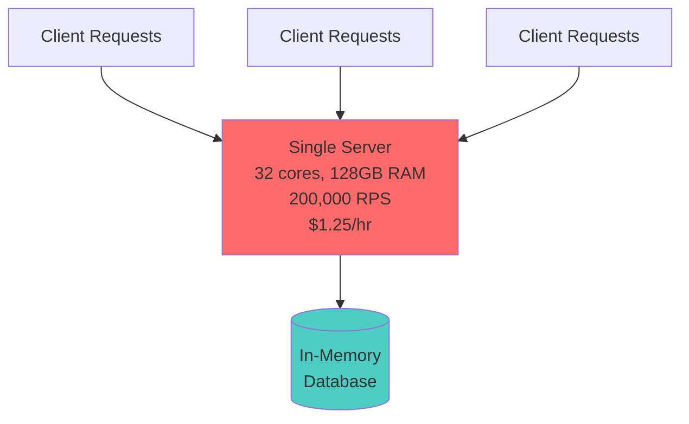
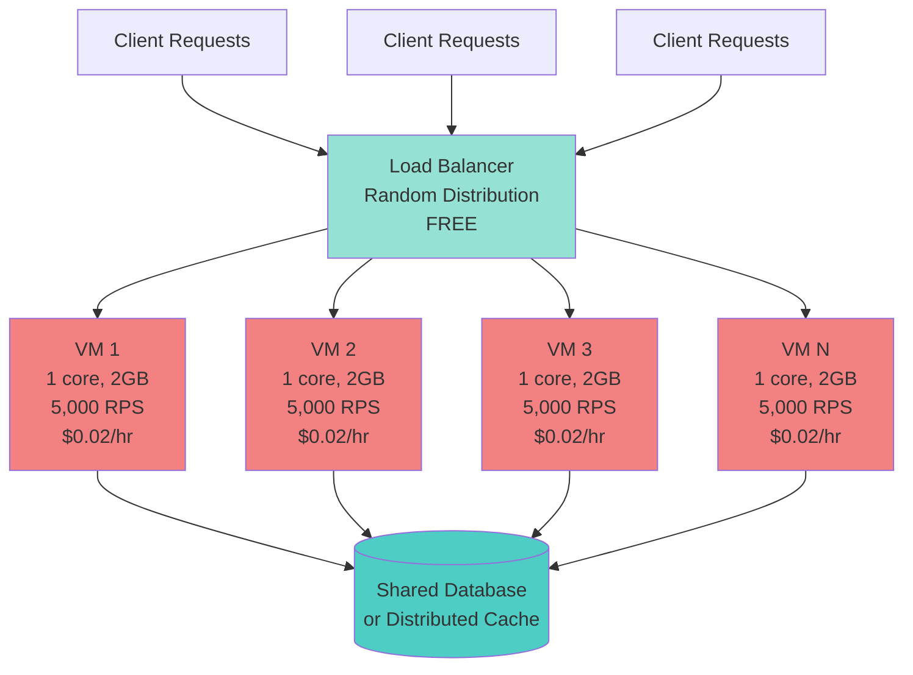
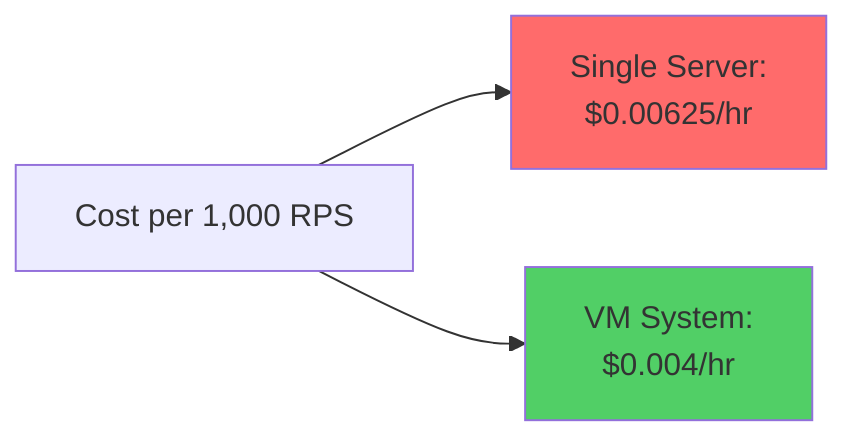

# Scaling Exercise: Book Company System Design

## Learning Goals
- Understand scaling up vs. scaling out
- Learn how cloud costs affect system design

---

## Problem Statement

### Current System: Single Server (Scale-Up Architecture)

**Specifications:**
- **Memory:** 128 GB
- **CPU:** 32 cores
- **Capacity:** 200,000 requests per second (RPS)
- **Cost:** $1.25 per hour

**Problem:** Peak load errors due to capacity limits. No hardware upgrades available.

### Proposed Solution: Scale-Out Architecture

**VM Specifications:**
- **Memory:** 2 GB per VM
- **CPU:** 1 core per VM
- **Capacity:** 5,000 RPS per VM
- **Cost:** $0.02 per hour per VM

**Available Resource:** Free network load balancer (random distribution)

---

## Deliverable 1: System Design

### Current Architecture (Single Server)



**How It Works:**
1. All client requests go directly to the single server
2. Server processes requests using 32 cores
3. In-memory database stores data
4. **Bottleneck:** Single point of failure, limited by hardware capacity

**Problems:**
- Cannot handle more than 200,000 RPS
- Peak loads cause errors
- No upgrade path available
- Single point of failure

---

### Proposed Architecture (Scale-Out with Load Balancer)



**How It Works:**

1. **Load Balancer (Entry Point)**
   - Receives all incoming client requests
   - Randomly distributes requests across available VMs
   - Free to use (provided by friend)
   - Single point of routing but not processing

2. **VM Pool (Compute Layer)**
   - Multiple identical VMs process requests in parallel
   - Each VM handles up to 5,000 RPS independently
   - Stateless servers (session data stored externally)
   - Can add/remove VMs dynamically based on load

3. **Shared Data Layer**
   - Centralized database or distributed cache
   - All VMs connect to same data store
   - Ensures consistency across the system
   - Could be Redis, Memcached, or distributed database

4. **Request Flow:**
   ```
   Client Request → Load Balancer → Selected VM → Database → Response → Client
   ```

**Advantages:**
- **Horizontal Scalability:** Add more VMs as needed
- **Fault Tolerance:** If one VM fails, others continue serving
- **Cost Efficiency:** Pay only for capacity you use
- **Elastic:** Scale up during peaks, down during quiet periods
- **No Single Point of Failure:** Multiple VMs handle load

**Design Considerations:**

**Session Management:**
- Use stateless design with JWT tokens, or
- Store sessions in shared Redis/Memcached
- Load balancer doesn't need sticky sessions

**Database Architecture:**
- **Option A:** Single shared database (simple but potential bottleneck)
- **Option B:** Read replicas for scaling reads
- **Option C:** Distributed database (Cassandra, DynamoDB)
- **Option D:** Caching layer (Redis) + database

**Health Checks:**
- Load balancer pings VMs periodically
- Unhealthy VMs removed from rotation automatically
- Failed VMs replaced with new instances

---

## Deliverable 2: Cost Comparison

### Single Server Cost Analysis

| Component | Quantity | Unit Cost | Total Cost |
|-----------|----------|-----------|------------|
| Server (32 core) | 1 | $1.25/hr | **$1.25/hr** |
| **Daily Cost** | | | **$30.00/day** |
| **Monthly Cost** | | | **$900.00/month** |

**Capacity:** 200,000 RPS (maximum)

---

### VM System Cost Analysis (Matching 200,000 RPS)

**VMs Required:** 200,000 RPS ÷ 5,000 RPS per VM = **40 VMs**

| Component | Quantity | Unit Cost | Total Cost |
|-----------|----------|-----------|------------|
| VMs (1 core) | 40 | $0.02/hr | **$0.80/hr** |
| Load Balancer | 1 | Free | **$0.00/hr** |
| **Total Hourly** | | | **$0.80/hr** |
| **Daily Cost** | | | **$19.20/day** |
| **Monthly Cost** | | | **$576.00/month** |

**Capacity:** 200,000 RPS (same as single server)

---

### Cost Comparison Summary

| Metric | Single Server | VM System (40 VMs) | Savings |
|--------|---------------|-------------------|---------|
| **Hourly Cost** | $1.25 | $0.80 | $0.45 (36%) |
| **Daily Cost** | $30.00 | $19.20 | $10.80 (36%) |
| **Monthly Cost** | $900.00 | $576.00 | $324.00 (36%) |
| **Annual Cost** | $10,950.00 | $7,008.00 | $3,942.00 (36%) |
| **Capacity** | 200,000 RPS | 200,000 RPS | Same |
| **Scalability** | None | Unlimited | ✓ |

**Key Findings:**
- VM system saves **$0.45/hour** or **36%** for the same capacity
- Annual savings: **$3,942**
- VM system can scale beyond 200,000 RPS; single server cannot
- Break-even point: VM system is cheaper at all capacity levels

---

## Deliverable 3: Scaling Calculations

### Scenario 1: Handling 200,000 RPS (Current Capacity)

**VMs Required:**
```
VMs = Total RPS / RPS per VM
VMs = 200,000 / 5,000
VMs = 40 VMs
```

**Cost Calculation:**
```
Hourly Cost = Number of VMs × Cost per VM
Hourly Cost = 40 × $0.02
Hourly Cost = $0.80/hour
```

**Summary:**
- **VMs Needed:** 40
- **Total Capacity:** 200,000 RPS
- **Hourly Cost:** $0.80
- **Daily Cost:** $19.20
- **Monthly Cost:** $576.00
- **vs. Single Server:** 36% cheaper

---

### Scenario 2: Handling 10,000,000 RPS (50x Growth)

**VMs Required:**
```
VMs = Total RPS / RPS per VM
VMs = 10,000,000 / 5,000
VMs = 2,000 VMs
```

**Cost Calculation:**
```
Hourly Cost = Number of VMs × Cost per VM
Hourly Cost = 2,000 × $0.02
Hourly Cost = $40.00/hour
```

**Summary:**
- **VMs Needed:** 2,000
- **Total Capacity:** 10,000,000 RPS
- **Hourly Cost:** $40.00
- **Daily Cost:** $960.00
- **Monthly Cost:** $28,800.00

**Single Server Equivalent:**
- Would need **50 servers** at 200,000 RPS each
- Cost: 50 × $1.25 = **$62.50/hour**
- Monthly: **$45,000.00**
- **Savings with VMs:** $16,200/month (36%)

---

### Scaling Comparison Table

| Target RPS | VMs Needed | Hourly Cost | Monthly Cost | Single Server Cost* | Savings |
|------------|------------|-------------|--------------|---------------------|---------|
| 50,000 | 10 | $0.20 | $144.00 | $312.50 | 54% |
| 100,000 | 20 | $0.40 | $288.00 | $625.00 | 54% |
| 200,000 | 40 | $0.80 | $576.00 | $900.00 | 36% |
| 500,000 | 100 | $2.00 | $1,440.00 | $2,812.50 | 49% |
| 1,000,000 | 200 | $4.00 | $2,880.00 | $5,625.00 | 49% |
| 5,000,000 | 1,000 | $20.00 | $14,400.00 | $28,125.00 | 49% |
| 10,000,000 | 2,000 | $40.00 | $28,800.00 | $45,000.00 | 36% |

*Single server cost calculated as: (Target RPS / 200,000) × $1.25/hr

---

## Analysis & Insights

### Cost Efficiency by Scale



**Cost per 1,000 RPS:**
- **Single Server:** $1.25 / 200 = $0.00625 per 1,000 RPS
- **VM System:** $0.02 / 5 = $0.004 per 1,000 RPS
- **VM Advantage:** 36% lower cost per unit of capacity

---

### When to Choose Each Approach

#### Scale-Up (Single Server) - Better When:
- Small scale (under 100,000 RPS)
- Simplicity is critical
- Low operational overhead needed
- No distributed systems expertise
- Tight latency requirements (no network hops)

#### Scale-Out (VM Pool) - Better When:
- ✓ Growth expected beyond hardware limits
- ✓ High availability required
- ✓ Cost optimization important at scale
- ✓ Elastic demand (peaks and valleys)
- ✓ Geographic distribution needed
- ✓ Already at hardware limits (our situation)

---

### Additional Considerations

#### Network Costs
- Data transfer between load balancer and VMs
- Database connection overhead (40-2,000 connections)
- May add $100-500/month depending on traffic

#### Database Bottleneck
- 40+ VMs connecting to one database
- Need connection pooling
- May need database scaling:
  - Read replicas
  - Caching layer (Redis/Memcached)
  - Sharding for writes

#### Operational Complexity
- Monitoring 40-2,000 VMs vs. 1 server
- Auto-scaling policies needed
- Deployment coordination
- Log aggregation
- Health check systems

#### Latency Considerations
- Single server: Direct connection (~1ms)
- VM system: Load balancer + VM (~3-5ms)
- Trade-off: Slight latency increase for massive scalability

---

## Recommendations

### Immediate Action (Solving Current Problem)
1. **Deploy 40 VMs** to match current 200,000 RPS capacity
2. Implement load balancer with health checks
3. Migrate in-memory database to shared Redis/database
4. **Save $324/month** immediately

### Short-Term (Next 6 months)
1. Implement auto-scaling based on CPU/RPS metrics
2. Add monitoring and alerting
3. Set up blue-green deployment for zero-downtime updates
4. Scale to 100-200 VMs as traffic grows

### Long-Term (1+ years)
1. Consider multi-region deployment for global users
2. Implement CDN for static content
3. Database sharding if needed
4. Microservices architecture for better scaling

---

## Formulas Reference

### VM Calculation
```
Required VMs = Total RPS Needed / RPS per VM
Required VMs = Total RPS / 5,000
```

### Cost Calculation
```
Hourly Cost = Number of VMs × $0.02
Daily Cost = Hourly Cost × 24
Monthly Cost = Daily Cost × 30
```

### Efficiency Metric
```
Cost per 1K RPS = Hourly Cost / (Total RPS / 1,000)
```

---

## Conclusion

**For 200,000 RPS:**
- **40 VMs required**
- **$0.80/hour cost**
- **36% cheaper than single server**
- Enables future growth

**For 10,000,000 RPS:**
- **2,000 VMs required**
- **$40.00/hour cost**
- **Single server cannot achieve this scale**
- Still 36% cheaper than equivalent single servers

The scale-out approach with VMs is both **more cost-effective** and **enables unlimited growth** beyond the hardware limitations of the single server approach. The VM system pays for itself through cost savings while providing better availability and scalability.
